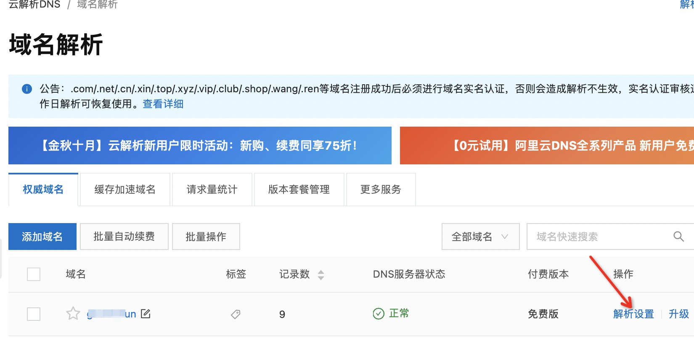
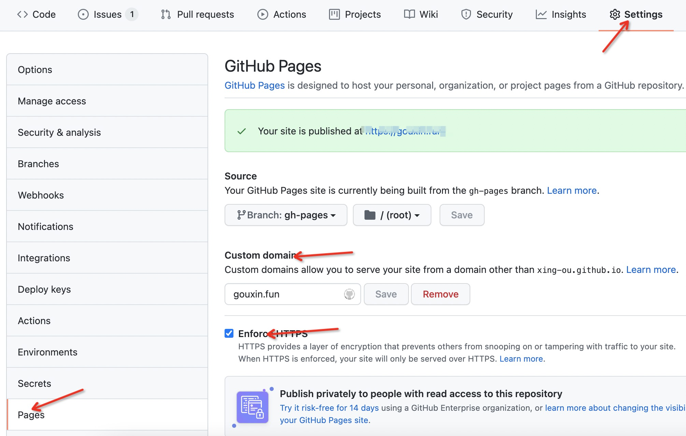

当我们把blog托管在github page上后，就能得到一个`<userName>.github.io`的域名。不过有点丑，没关系我们还可以用自己的域名。

### 第一步：购买域名

我是在阿里云上买的一个域名，购买完成后，进入`解析设置`， 然后添加记录。



##### 添加一个CNAME记录

记录类型：CNAME

主机记录：www

记录值:  xxx.github.io

##### 添加多个A记录

参考[官方文档](https://docs.github.com/en/pages/configuring-a-custom-domain-for-your-github-pages-site/managing-a-custom-domain-for-your-github-pages-site#configuring-an-apex-domain), 添加多个A 和 AAAA

记录类型：A

主机记录：不填

记录值:  185.199.108.153

### 第二步：修改仓库setting



Custom domain处填写你自己的域名，然后等一会github解析，成功后勾选`Enforce https`。

现在就可以访问新的。

### 第三步：其他修改

如果你使用像`docusaurus`这样的框架，那么还得修改config文件中的url和baseUrl。

```json
{
  url: 'https://gouxin.fun',
  baseUrl: '/',
}
```

重新部署下就好了.