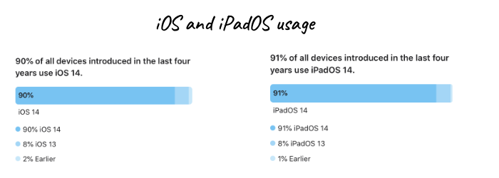
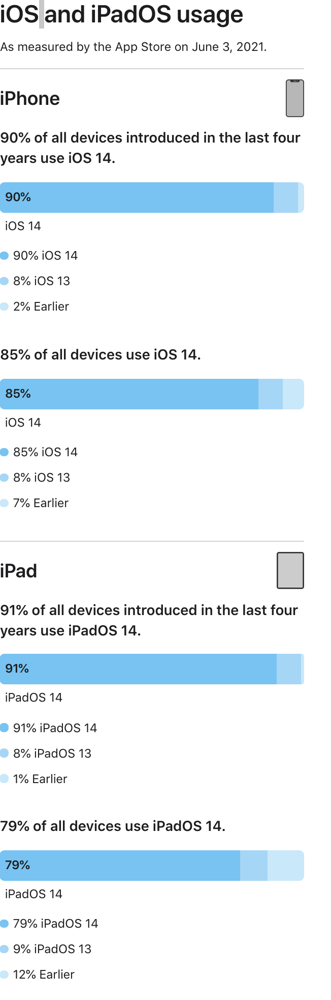

每当开始新项目的时候，我们都得决定应该把最低系统版本设置为多少，此时，我们都希望能有个参考，市场上的系统版本的占比究竟是多少？
苹果官网有一个最近3个系统版本的占比统计，我们可以参考一下。

<!--truncate-->

## 官网占比统计

[官网统计页面](https://developer.apple.com/support/app-store/)

可以看到统计时间是2021年6月3日，

iphone

- 近四年的设备中已有98%到iOS13以上。

- 所有设备中93%已经到iOS13以上。

iPad

- 近四年的设备中已有99%到iOS13以上。
- 所有设备中88%已经到iOS13以上。

## 常用App的最低版本

我们再去appstore中看下免费App排行榜设置的最低版本是多少。

| App名称      | 兼容性 |
| ------------ | ------ |
| 国家反诈中心 | iOS10  |
| 微信         | iOS12  |
| 抖音         | iOS10  |
| QQ           | iOS9   |
| 支付宝       | iOS9   |
| 拼多多       | iOS9   |
| 淘宝         | iOS9   |
| 百度         | iOS10  |
| 美团         | iOS10  |
| 剪映         | iOS11  |
| 高德地图     | iOS10  |
| 小红书       | iOS10  |
| 得物         | iOS10  |
| 快手极速版   | iOS9   |
| 快手         | iOS10  |
| 抖音极速版   | iOS10  |
| 腾讯视频     | iOS10  |
| 咸鱼         | iOS9   |
| 京东         | iOS9   |
| 钉钉         | iOS10  |
| 酷狗音乐     | iOS9   |
| 优酷         | iOS10  |
| QQ音乐       | iOS9   |
| 网易云音乐   | iOS11  |
| 哔哩哔哩     | iOS9   |
| 爱奇艺       | iOS10  |
| Soul   | iOS11  |
| 知乎   | iOS11  |
| 今日头条      | iOS10  |
| 虎牙直播      | iOS10  |
| 探探   | iOS11  |
| 。。。   |   |

可以看到主流是iOS10。iOS11也呈现出增多的趋势。微信竟然直接是iOS12。
