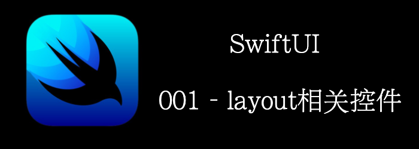

本文将介绍用于布局相关的一些控件

- VStack
- HStack
- ZStack
- Spacer
- Divider
<!--truncate-->
## 准备

先创建一个叫做`TheStacks`的SwiftUI工程。

## 写代码

修改ContentView里的body为以下代码, 然后resume Preview：

```swift
VStack {
            Text("VStack Item 1")
            Text("VStack Item 2")
            Text("VStack Item 3")
        }.background(Color.blue)
```


然后我们在添加一些Divider和Spacer。

```swift
VStack {
            Text("VStack Item 1")
            Text("VStack Item 2")
            Spacer()
            Divider().background(Color.white)
            Text("VStack Item 3")            
        }.background(Color.blue)
```


我们再在`item 3`之后加一个HStack和ZStack。

```swift
VStack {
            Text("VStack Item 1")
            Text("VStack Item 2")
            Spacer()
            Divider().background(Color.white)
            Text("VStack Item 3")
            HStack {
                Text("Item 1")
                Divider().background(Color.black)
                Text("HStack Item 2")
                Divider().background(Color.black)
                Spacer()
                Text("HStack Item 3")
            }.background(Color.red)
            ZStack {
                Text("ZStack Item 1").padding().background(Color.green).opacity(0.8)
                Text("ZStack Item 2").padding().background(Color.green).offset(x: 80, y: -400)
            }
        }.background(Color.blue)
```


## 这是怎么工作的？

一个新的SwiftUI工程默认是以一个居中的Text开始的。

`body`返回一个`View`。

如果要添加竖直排列的其他View，我们用VStack替换掉默认的Text，然后添加内容。

SwiftUI的Stack使用如下步骤来决定如何显示它的内容(详细可参考WWDC2019:利用SwiftUI构建自定义视图)：

1. Figure out its internal spacing and subtract that from the size proposed by its parent view.(确定子视图的大小，从父视图提供的大小中减去子视图)
2. Divide the remaining space into equal parts.(将剩余空间按剩余子视图数量等分)
3. Process the size of its least flexible view.(处理 least flexibl的视图，确定其大小)
4. Divide the remaining unclaimed space by the unallocated space, and then repeat *Step 2*.（用剩余空间减去其大小，再重复步骤2）
5. The stack then aligns its content and chooses its own size to exactly enclose its children.( stack对其他的内容，确定其自身大小，其大小是刚好包裹子视图)

添加**Spacer**可以强制View使用最大的空间。这是因为**Spacer()**是最flexible的视图，它在显示所有其他视图之后填充剩余空间。

**Divider**用来画一个占满parent宽度的水平线，这也是为什么我们加了**Divider**后，蓝色背景会撑满屏幕宽度。默认**Divider**没有颜色，我们可以通过`.background(Color)`modifier来设置。

modifier是一系列可以应用到View上的方法，换句话说：他将某些改动设置到View上，然后返回新的View。

常用的**.background(Color. black)**, **.padding()**, and **.offsets(…)**都是modifier。

**HStack**和**VStack**类似，不过他是水平从左到右显示他的内容。添加**Spacer**到**HStack**中，会让它填满水平空白区域，**Divider**也是竖直向下的。

**ZStack**和**HStack** 、 **VStack** 类似，不过是重叠他的content在已有的item上。

## There's more…

你还可以使用**.frame** modifier来调整component的width和height。

```swift
.frame(
  maxWidth: .infinity,
	maxHeight: .infinity,
	alignment: .topLeading
)
```

## SwiftUI 中布局的工作原理

详细可参考WWDC2019:利用SwiftUI构建自定义视图

### Hello world布局

我们先来看一个Hello world的例子。


这里有3个View：

- Text: 大小由文本决定
- ContentView：大小由children决定，所以上图中ContentView的大小刚好包裹Text
- RootView：屏幕减去safeArea的区域，你可以通过`.edgesIgnoringSafeArea(.all)`modifier来修改这个行为，这样就是整个屏幕。


我们把任何带有`var body: some View`的视图成为`中性视图(Layout Neutral)`，他的边界是由他的`body`决定的，因此我们上面才说ContentView的大小和Text是一致的。

我们再来看看布局过程：

- RootView：嘿，我有整个安全区域那么大，你需要多大的空间？
- ContentView：好的，但是我是中性视图，我得问下我的body。Text你好，我有整个安全区域那么大，你需要多少空间？
- Text：好的，我的文本是Helloworld，我只需要100 * 20那么大。
- ContentView：好的，我是中性视图，你多大我就多大，RootView，我只需要100 * 20那么大。
- RootView：好的，我还有很多剩余空间，我默认会把你放到我的center那里。


总结下布局过程：

1. Parent为children提供一个size
2. Children确定自己的大小
3. Parent将children放到自己的坐标系中
4. 屏幕像素是整数，但大小是小数，处理小数大小，会round到最近的整数

### 更复杂的例子


- RootView：嘿，我有整个安全区域那么大，你需要多大的空间？
- Toast：好的，但是我是中性视图，我得问下我的body。Background你好，我有整个安全区域那么大，你需要多少空间？
- Background: 好的，但是我也是中性视图。Padding你好，我有整个安全区域那么大，你需要多少空间？
- Padding：好的。Text你好，我有整个安全区域减去10 padding那么多空间，你需要多少空间？
- Text：我需要100* 100 。
- Padding: 好的, Background，我只需要110* 110
- Background: 好的，我还有子视图Color，我得问下他，Color你好，我有110 * 110, 那么大，你需要多少。
- Color：我也需要110 * 110
- Background：好的，Toast，我只需要110 *110
- Toast: 好的,RootView，我也只需要110* 110
- RootView: 好的，我还有很多剩余空间，我默认会把你放到我的center那里。

### 再来一个简单但重要的例子


SwiftUI中除非你指定图片是可缩放的，否则图片的size就是图片本身的大小。

现在我想让图片是30x30，我们加个frame modifier。


你会在图片周围发现一个30x30的框，这和我们刚刚说的图片大小不可改矛盾了么？

frame并不是约束，而是modifier，modifier返回的是一个新的view。所以你加了frame modifier后，30x30实际上是新的view。Image还是20x20。

### 再看看Stack的布局原理


我们首先得注意到，SwiftUI并不是直接吧Stack堆砌在一起，而是在他们之间留有adaptive space。这是SwiftUI将apple 人性化设计指南的一些规则默认应用到了SwiftUI的结果，他们希望你能通过最简单的代码，也能产生漂亮的结果。如果你不希望有这些space，可以在Stack初始化的参数中指定spacing为0。


```swift
VStack(spacing: 0) {
            Text("hello world111").background(Color.red)
            Image("question-circle").background(Color.green)
        }
```

现在我们来分析下Stack是如何工作的？我们看个例子。


1. 首先Parent告诉HStack建议的size
2. HStack先减去spacing(如果没指定，是有默认space的，上面说过)，得到剩余空间
3. 因为HStack有3个children，所以将剩余空间3等分
4. 找出least flexible的子视图，其中图片是least flexible的，因为他的size是固定的。所以剩余空间减去图片size
5. 重复上面过程。目前有2个children。所以2等分
6. 两个优先级一样，因此处理第一个，先把一半的size分配给`Delicious`。但`Delicious`说，太多了，我要不了这么多，我只要这么多size。
7. 再重复上面的过程，得到最新的剩余空间
8. 把剩下的所有空间分配给`Avocado Toast`。`Avocado Toast`说，太多了，我用不完这么多空间。于是`Avocado Toast`刚好能显示完，整个HStack的size会比Parent提供的小一些。
9. 水平方向的size确定了，然后确定竖直方向的。竖直方向按照HStack的`alignment`参数对其，然后size刚好能包裹整个Hstack。
10. 至此整个Hstack的大小就完全确定了。

再来看看，如果第8步中剩余空间不够`Avocado Toast`显示了，那么`Avocado Toast`会被截断


但是如果我们想尽可能不截断`Avocado Toast`,优先截断`Delicios`，要怎么做呢？我们可以指定优先级。


在有优先级的情况下，SwiftUI会先给所有低优先级的视图预留最小size，然后把剩余空间分配给高优先级视图：


### Alignment

#### alignmentGuide

还记得我们第9步中说到`alignment`么？这里再多说一点其中的基线对其`lastTextBaseline`。有时候我们可能对默认基线对其不满意， 我们可以通过`alignmentGuide`自定义对其位置:


`.alignmentGuide(.lastTextBaseline) { d in d[.bottom] * 0.975 }`的意思是对于`lastTextBaseline`这种对其方式，他的对其位置是在`.bottom`的0.927处

#### 自定义对其方式


考虑下我们要将星星，和`Avocado Toast`对其。啥？他们不是在两个不同的VStack中么？没关系我们可以自定义对其方式，让他们对其。

首先，自定义一种对其方式`midStartAndTitle`：


使用新的对其方式


