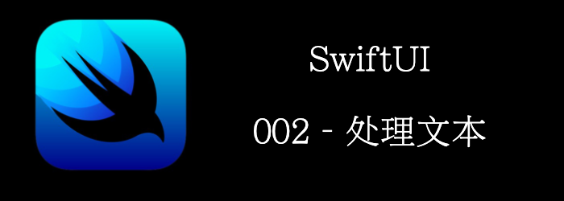

文本是任何App的一个基础。
本章我们将介绍：
- **Text**
- **TextField**
- **SecureField**
- **TextEditor**

<!--truncate-->

## 准备

创建一个名为**FormattedText**的新 SwiftUI 项目。

## 怎么做…

首先将Text用VStack包裹一下

```swift
struct ContentView: View {
var body: some View {
        VStack{
            Text("Hello World")
        }
    }
}
```

然后添加一个fontWeight modifier。

```swift
Text("Hello World").fontWeight(.medium)
```

添加两个个state

```swift
@State var password = ""
@State var someText = ""
```

添加一个Text和SecureField, 用Text显示SecureField的输入

```swift
SecureField("Enter a password", text: $password).padding()
Text("password entered: \(password)").italic()
```

添加一个Text和TextField，用Text显示TextField的输入

```swift
TextField("Enter some text", text: $someText).padding()
Text("\(someText)").font(.largeTitle).underline()
```

再尝试一下其他modifier

```swift
Text("Changing text color and make it bold").foregroundColor(Color.blue).bold()
Text("Use kerning to change space between lines of text").kerning(7)
Text("Changing baseline offset").baselineOffset(100)
Text("Strikethrough").strikethrough()
Text("This is a multiline text implemented in SwiftUI. The trailing modifier was added to the text. This text also implements multiple modifiers")
	.background(Color.yellow)
	.multilineTextAlignment(.trailing)
	.lineSpacing(10)
```


## How it works…

Text有关于font，spacing等相关的Modifier。TextFiled和SecureField都需要一个`State`来存储输入，我们可以使用`@State`来声明一个`State`。SwiftUI会在`State`改变时，自动刷新UI。

我们通过$来绑定`State`。

```swift
  TextField("Enter some text", text: $someText)     
```

## There's more…

我们继续添加Text，当子视图超过10个时，就会报错。原来是SwiftUI只支持最大10个子视图。所以此时，我们需要使用`Group`来分割我们的子视图。

## 详细介绍

### Text

用于显示1行或者多行的只读文本。

#### Creating a Text View from a String

```swift
//国际化
init(_ key: LocalizedStringKey, tableName: String? = nil, bundle: Bundle? = nil, comment: StaticString? = nil)
//普通字符串，无国际化
init<S>(_ content: S) where S : StringProtocol
//富文本
init(_ attributedContent: AttributedString)
```

#### Creating a Text View for a Date

```swift
// 显示某个时间范围3:09-3.10 PM
init(_ dates: ClosedRange<Date>)
init(_ interval: DateInterval)
// 显示日期, 按照style
init(_ date: Date, style: Text.DateStyle)
```

#### Creating a Text View with Formatting

显示非string对象, 需要你的type遵循FormatStyle协议。

```swift
init<F>(_ input: F.FormatInput, format: F) where F : FormatStyle, F.FormatInput : Equatable, F.FormatOutput == String
init<Subject>(_ subject: Subject, formatter: Formatter) where Subject : ReferenceConvertible
init<Subject>(_ subject: Subject, formatter: Formatter) where Subject : NSObject
```

我们也可以实现自己的formater。比如我们要格式化日期为yyyy-MM-dd。但默认Date.FormatStyle提供的似乎不够用，我们可以实现自己的formater。

```swift
struct YYYYMMddDateStyle: FormatStyle {
    typealias FormatInput = Date
    typealias FormatOutput = String
    
    static let dateFormater: DateFormatter = {
        let formater = DateFormatter()
        formater.dateFormat = "yyyy-MM-dd"
        return formater
    }()
    func format(_ value: Date) -> String {
        return YYYYMMddDateStyle.dateFormater.string(from: value)
    }
}
/// 扩展一下FormatStyle，这样就有提示了
extension FormatStyle where Self == YYYYMMddDateStyle {
    static var yyyyMMddDateStyle:YYYYMMddDateStyle { return .init() }
}

//使用
struct ContentView: View {
    var body: some View {
        Text.init(Date(), format: .yyyyMMddDateStyle)
    }
}
```

#### Creating a Text View from an Image

将图片包裹为Text，适合和其他Text拼接。

```swift
init(_ image: Image)
```

例子:

```swift
struct ContentView: View {
    @State var password = ""
    @State var someText = "Initial text"
    var body: some View {
            Text("hello") + Text(Image("my-img-name")) + Text("world")
    }
}            
```

#### Choosing a Font

字体相关：

```swift
func font(Font?) -> Text
func fontWeight(Font.Weight?) -> Text
```

#### Styling the View’s Text

文本样式

```swift
func foregroundColor(Color?) -> Text
func bold() -> Text
func italic() -> Text
func strikethrough(Bool, color: Color?) -> Text
func underline(Bool, color: Color?) -> Text
func monospacedDigit() -> Text
func kerning(CGFloat) -> Text
func tracking(CGFloat) -> Text
func baselineOffset(CGFloat) -> Text
func textCase(Text.Case?) -> some View
```

#### Fitting Text into Available Space

缩放相关:

```swift
func allowsTightening(Bool) -> some View//是否允许缩放两个字符间的间距
func minimumScaleFactor(CGFloat) -> some View//缩放字体
func truncationMode(Text.TruncationMode) -> some View//截断
```

#### Handling Multiline Text

处理多行文本

```swift
func lineLimit(Int?) -> some View
func lineSpacing(CGFloat) -> some View
func multilineTextAlignment(TextAlignment) -> some View
```

#### 其他

还有些voiceover和accessbility相关的功能，可以暂时忽略


### TextField

输入框。

#### Creating a Text Field with a String Value

textfield和string绑定。需要3个东西： title, binding和prompt。

```swift
init(_ titleKey: LocalizedStringKey, text: Binding<String>, prompt: Text?)
init<S>(_ title: S, text: Binding<String>, prompt: Text?) where S : StringProtocol
init(text: Binding<String>, prompt: Text? = nil, label: () -> Label)
```

注意title和prompt的区别。

```swift
Form {
    TextField(text: $username, prompt: Text("Required")) {
        Text("Username")
    }
    SecureField(text: $password, prompt: Text("Required")) {
        Text("Password")
    }
}
```

在macOS上：前面的文字是title/label。placeholder是prompt。


在ios上，不会单独显示label，如果提供了prompt，则用prompt作为placeholder，没有提供则用title/label作为placeholder。


#### Creating a Text Field with an Arbitrary Value

TextField并不一定只能binding到String，可以Binding到任何类型，只是需要一个ParseableFormatStyle 或者 Formatter。

```swift
init<F>(_ titleKey: LocalizedStringKey, value: Binding<F.FormatInput>, format: F, prompt: Text? = nil) where F : ParseableFormatStyle, F.FormatOutput == String
init<S, F>(_ title: S, value: Binding<F.FormatInput>, format: F, prompt: Text? = nil) where S : StringProtocol, F : ParseableFormatStyle, F.FormatOutput == String
init<F>(value: Binding<F.FormatInput>, format: F, prompt: Text? = nil, label: () -> Label) where F : ParseableFormatStyle, F.FormatOutput == String
init<V>(_ titleKey: LocalizedStringKey, value: Binding<V>, formatter: Formatter, prompt: Text?)
init<S, V>(_ title: S, value: Binding<V>, formatter: Formatter, prompt: Text?) where S : StringProtocol
init<V>(value: Binding<V>, formatter: Formatter, prompt: Text? = nil, label: () -> Label)
```

我们来举个例子，将一个Person绑定到TextField。TextField显示`firstName lastName`。

先定义Person

```swift
struct Person {
    var firstName = ""
    var lastName = ""
}
```

定义解析策略，负责将String解析成Person

```swift
/// 解析，负责将string解析成自定义类型
struct PersonParseStrategy: ParseStrategy {
    typealias ParseInput = String
    typealias ParseOutput = Person
    func parse(_ value: String) throws -> Person {
        var components = value.components(separatedBy: " ")
        if components.isEmpty {
            return Person()
        } else if components.count == 1 {
            return Person(firstName: components[0], lastName: "")
        } else {
            let firstName = components[0]
            components.removeFirst()
            let lastName = components.joined(separator: " ")
            return Person(firstName: firstName, lastName: lastName)
        }
    }
}
```

定义FormatStyle，负责将Person格式化为String

```swift
/// formater, 负责将自定义类型解析成textfield的显示
struct PersonNameFormatStyle: ParseableFormatStyle {
    typealias Strategy = PersonParseStrategy
    typealias FormatInput = Person
    typealias FormatOutput = String
    var parseStrategy = PersonParseStrategy()
    func format(_ value: Person) -> String {
        return "\(value.firstName) \(value.lastName)"
    }
}
@available(iOS 15.0, *)
extension ParseableFormatStyle where Self == PersonNameFormatStyle {
    static var personNameFormatStyle: PersonNameFormatStyle { .init() }
}
```

使用

```swift
struct ContentView: View {
    @State var person = Person()
    var body: some View {
    TextField("请输入姓名", value: $person, format: .personNameFormatStyle, prompt: nil)
		Text("firstName:\(person.firstName) lastName:\(person.lastName)")
    }
}       
```

#### Creating a Text Field with an Arbitrary Optional

和上面的类似，只是支持Optional

```swift
init<F>(_ titleKey: LocalizedStringKey, value: Binding<F.FormatInput?>, format: F, prompt: Text? = nil) where F : ParseableFormatStyle, F.FormatOutput == String
....省略
```

#### Styling Text Fields

设置text field的style

```swift
func textFieldStyle<S>(_ style: S) -> some View where S : TextFieldStyle
```

举例

```swift
TextField("请输入姓名", value: $person, format: .personNameFormatStyle, prompt: nil)
.textFieldStyle(.roundedBorder)
```

#### 常用的UITextFieldDelegate对比

.editingChanged

```swift
TextField("", text: $password)
   .onChange(of: password) { newValue in
        password = Format(password)
   }
```

.editingDidBegin / .editingDidEnd

```
@FocusState var isFocused: Bool
TextField("", text: $password)
    .focused($isFocused)                
    .onChange(of: isFocused) { newValue in
       print("current foucus state \(newValue)")
    }
```

textShouldReturn

```swift
TextField("", text: $password)
   .onSubmit {
       print("clicked return btn")
   }
```

### SecureField

只能binding到string，不能像TextField一样可以绑定任何值。

没有显示真实输入密码的功能。要实现眼睛功能，只有用TextField和SecureField一起。

#### Creating a Secure Text Field

和texfiled类似

```swift
init<S>(_ title: S, text: Binding<String>, prompt: Text?) where S : StringProtocol
```

#### Configuring Text Entry

```swift
func keyboardType(_ type: UIKeyboardType) -> some View //键盘类型
func disableAutocorrection(_ disable: Bool?) -> some View //自动修正
func textInputAutocapitalization(_ autocapitalization: TextInputAutocapitalization?) -> some View //自动首字母大小写
//设置文本类型，系统会根据类型为输入提供建议
func textContentType(_ textContentType: UITextContentType?) -> some View
```

### TextEditor

显示和编辑多行较长的文本

#### Creating a Text Editor

```swift
init(text: Binding<String>)
```

#### Styling the View’s Text

```swift
func font(_ font: Font?) -> some View
func foregroundColor(_ color: Color?) -> some View
func multilineTextAlignment(_ alignment: TextAlignment) -> some View
func lineSpacing(_ lineSpacing: CGFloat) -> some View
func allowsTightening(_ flag: Bool) -> some View
```

#### Managing Text Entry

```swift
func textInputAutocapitalization(_ autocapitalization: TextInputAutocapitalization?) -> some View
func disableAutocorrection(_ disable: Bool?) -> some View
func keyboardType(_ type: UIKeyboardType) -> some View
```


