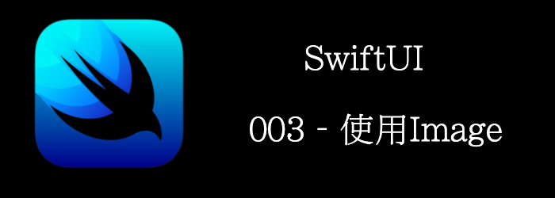

这一章，我们将介绍如何添加Image到View中。
<!--truncate-->
## Getting ready

新建一个SwiftUI工程，叫做**ImageApp**

## How to do it…

首先让我们添加一些图片到Assert中，然后我们再介绍一些modifier来修改图片样式。

1. 替换Text为VStack
2. 从https://github.com/PacktPublishing/SwiftUI-Cookbook-2nd-Edition/tree/main/Resources/Chapter01/recipe3下载图片
3. 拖动图片到Asserts中
4. 添加一个`Image`到`VStack中`
```swift
Image("dogs1")
```


5. 添加一个`.resizable()`modifier, 他能让SwiftUI调整图片大小以适应可以用空间。

```swift
Image("dogs1")
.resizable()
```


6. 我们看到图片被压缩了，继续添加一个`.aspectRatio`

```swift
Image("dogs1")
    .resizable()
    .aspectRatio(contentMode: .fit)
```


7. 继续添加 **dog-and-nature**到`VStack`中

```swift
Image("dog-and-nature")
    .resizable()
    .aspectRatio(contentMode: .fit)
    .frame(width:300, height:200)
    .clipShape(Circle())
    .overlay(Circle().stroke(Color.blue, lineWidth: 6))
    .shadow(radius: 10)
```

8. 我们写个工具方法来获取UIImage

```swift
func getImageFromUIImage(image:String) -> UIImage {
    guard let img = UIImage(named: image) else {
        fatalError("Unable to load image")
    }
    return img
}
```

9. 然后使用UIImage来加载图片

```swift
Image(uiImage: getImageFromUIImage(image:"dog2"))
	.resizable()
	.frame(width: 200, height: 200)
	.aspectRatio(contentMode: .fit)
```

10. 最终效果


## How it works…

添加`Image`到View上时，`Image`默认显示原始尺寸。图片可能大了，也可能小了。

要让`Image`适应屏幕大小，我们需要添加`.resizable`modifier。这会让`Image`缩放以占满可用空间。

为了解决缩放的拉伸问题，我们可以使用`.aspectRatio`modifier。

但aspectFill时，图片可能超出范围，我们可以用`.clip()`裁减掉

如果我们要限制图片大小固定为某个值，可以使用`.frame`modifier。

如果想裁剪图片为某个形状，可以使用`.clipShape`modifier。

我们还可以使用`.overlay`和`.shadow`来添加边框和阴影。

注意modifer的顺序比较重要，不同顺序的组合可能得到不一样的结果。

## Image

我们可以中资源中创建Image

- 从bundle中的资源文件创建
- 从UIImage/NSImage创建
- 从CGImage创建
- 从SF Symbols创建

### Creating an Image

```swift
//通过name初始化，bundle为nil默认为main bundle
init(_ name: String, bundle: Bundle? = nil)

```

### Creating an Image for Use as a Control

```swift
//和上面的类似， label用作accessibility
init(_ name: String, bundle: Bundle? = nil, label: Text)
init(_ cgImage: CGImage, scale: CGFloat, orientation: Image.Orientation = .up, label: Text)
```

### Creating an Image for Decorative Use

```swift
///创建装饰性的image，不会有accessibility
init(decorative name: String, bundle: Bundle? = nil)
init(decorative cgImage: CGImage, scale: CGFloat, orientation: Image.Orientation = .up)
```

### Creating a System Symbol Image

```swift
init(systemName: String)
```

### Creating an Image from a System Representation

```swift
///通过平台对应的Image初始化
init(uiImage: UIImage)
init(nsImage: NSImage)
```

### Resizing and Scaling Images

```swift
/// 拉伸，EdgeInsets中间的区域不拉伸，四周拉伸，ResizingMode制定了拉伸方式
func resizable(capInsets: EdgeInsets = EdgeInsets(), resizingMode: Image.ResizingMode = .stretch) -> Image
```

### Specifying Image Rendering Behavior

```swift
///设置symble image的render方式
func symbolRenderingMode(_ mode: SymbolRenderingMode?) -> Image
//两种mode: original:图片本色 temple: 将所有不透明的颜色渲染为forgroundColor。
func renderingMode(_ renderingMode: Image.TemplateRenderingMode?) -> Image
///渲染那种需要插值的图片，指定插值质量
func interpolation(_ interpolation: Image.Interpolation) -> Image
///是否开启反锯齿
func antialiased(_ isAntialiased: Bool) -> Image
```


