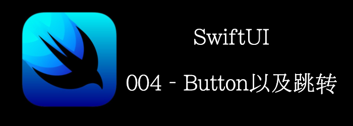

本章将介绍如何使用各种Button和如何跳转。

- Button
- EditButton
- PasteButton
- NavigationView
- NavigationLink

<!--truncate-->

## Getting ready

首先，新建一个**ButtonsApp**的SwiftUI工程。

## How to do it…

1. 新建文件
2. 模板选择**SwiftUI View**
3. 输入名称**ButtonView**
4. 重复上面步骤，创建**EditButtonView**
5. 重复上面步骤，创建**PasteButtonView**
6. 重复上面步骤，创建**MenuButtonView**，(**MenuButton**已经弃用了，使用**Menu**)
7. 打开**ContentView.swift**，在body中添加一个**NavigationView**
```swift
NavigationView {
    VStack {
        NavigationLink(destination: ButtonView()) {
            Text("Buttons").padding()
        }
        NavigationLink(destination: EditButtonView()) {
            Text("EditButtons").padding()
        }
        NavigationLink(destination: MenuButtonView()) {
            Text("MenuButtons").padding()
        }
        NavigationLink(destination: PasteButtonView()) {
            Text("PasteButtons").padding()
        }
        NavigationLink(destination:
            Text("Very long text that should not be displayed in a single line because it is not good design")
                .padding()
                .navigationBarTitle(Text("Detail"))
        ) {
            Text("details about text").padding()
        }
}.navigationBarTitle(Text("Main View"), displayMode:.inline)

```

最终显示如下：


8. 打开**EditButtonView.swift**，添加下面的代码，实现**EditButton**。
```swift
struct EditButtonView: View {
    @State private var animals = ["Cats", "Dogs", "Goats"]
    var body: some View {
        NavigationView {
            List {
                ForEach(animals, id: \.self) { animal in
                    Text(animal)
                }.onDelete(perform: removeAnimal)
            }
        }.navigationBarItems(trailing: EditButton())
        .navigationBarTitle(Text("EditButtonView"), displayMode: .inline)
    }
    
    func removeAnimal(at offsets: IndexSet){
        animals.remove(atOffsets: offsets)
    }
}
```

最终得到，点击右上角的Edit按钮，List会进入编辑状态。


9. 打开**MenuButtonView.swift**， 添加以下代码
```swift
var body: some View {
	Text("MenuButtons are currently available on MacOS currently")
  .padding()
  .navigationBarTitle("MenuButtons", displayMode:.inline)

/*
MenuButton("country +") {
Button("USA") { print("Selected USA") }.background(Color.accentColor)
Button("India") { print("Selected India") }
}
*/
}

```

10. 打开**PasteButtonView.swift**，添加以下代码
```swift
struct PasteButtonView: View {
    var body: some View {
        VStack {
            Text("PasteButton controls how you paste in macOS but is not available in iOS. For more information, check the \"See also\" section of this recipe")
                .padding()
        }.navigationBarTitle("PasteButton", displayMode: .inline)
    }
}
```

## How it works…

**NavigationLink**必须放在**NavigationView**里使用。

 **NavigationLink** 需要两个参数**destination** 和 **label**。**destination**代表点击后跳转的View。**label**代表显示的内容。

`.navigationBarTitle`modifier给ContentView界面添加了个title。第一个参数指定title的内容，第二个参数指定title显示的模式。.inline代表在标准的navigationBar中显示。

其他几个界面也有指定`.navigationBarTitle`，但是在preview中不会显示，在运行时才会显示。

**EditButton**和**List**一起使用，让List可编辑。我们之后再学习List。

**MenuButtons**和**PasteButtons**只能在macOS中使用。MenuButtons已被弃用，可以不用看了。

PasteButton可参考官方文档中的例子。

## API详情

### Button

#### Creating a Button

```swift
// action是点击时触发的方法， label控制显示内容
init(action: @escaping () -> Void, label: () -> Label)
init(_ titleKey: LocalizedStringKey, action: @escaping () -> Void)
```

#### Creating a Button with a Role

```swift
//多了个ButtonRole，用于描述Button语意，SwiftUI会根据语意添加样式，比如取消，是红色的。
init(role: ButtonRole?, action: @escaping () -> Void, label: () -> Label)
```

#### Creating a Button from a Configuration

```swift
///通过config初始化
init(_ configuration: PrimitiveButtonStyleConfiguration)
```

#### Setting a Border Shape

```swift
///设置border样式，
// capsule : 胶囊形状，  rounded rectangle： 圆角矩形，可自定义圆角大小
func buttonBorderShape(_ shape: ButtonBorderShape) -> some View
```

#### Styling Button Appearance

```swift
/// 设置样式，创建自定义样式
func buttonStyle<S>(_ style: S) -> some View where S : ButtonStyle
```

举个例子

```swift
struct RedborderStyle: PrimitiveButtonStyle {
    func makeBody(configuration: Configuration) -> some View {
        configuration.label.padding().border(Color.red)
    }
}

struct ButtonView: View {
    var body: some View {
        Button("你好") {
            print("hello")
        }.buttonStyle(RedborderStyle())
    }
}
```

### NavigationView

用于创建类似于UINavigationController的导航。

#### Creating a Navigation View

```swift
init(content: () -> Content)
```

#### Styling Navigation Views

```swift
func navigationViewStyle<S>(_ style: S) -> some View where S : NavigationViewStyle
```

#### Adding Titles

```swift
//导航栏标题
func navigationTitle(_ titleKey: LocalizedStringKey) -> some View
//subtitle，只有macOS才有
func navigationSubtitle<S>(_ subtitle: S) -> some View where S : StringProtocol
...
```

#### Managing Navigation Bars

```swift
//隐藏navigationbar
func navigationBarHidden(_ hidden: Bool) -> some View
func navigationBarBackButtonHidden(_ hidesBackButton: Bool) -> some View
///显示模式，inline: 正常大小导航栏居中， large：大的导航栏，居左
func navigationBarTitleDisplayMode(_ displayMode: NavigationBarItem.TitleDisplayMode) -> some View
```

### NavigationLink

控制navigation跳转的view。点击后会跳转到destination。当然除了，手动触发，也能够通过代码触发跳转。代码跳转有两种方式，一种是通过isActive，一种是通过tag+selection。

#### Presenting a Destination View

```swift
init(destination: () -> Destination, label: () -> Label)
init<S>(_ title: S, destination: () -> Destination) where S : StringProtocol
```

#### Presenting a Destination View with Programmatic Activation

```swift
///提供isActive，这样可以通过代码来跳转
init<S>(_ title: S, isActive: Binding<Bool>, destination: () -> Destination) where S : StringProtocol
...
```

举个例子, 下面的点击两个按钮都能跳转到对应View。

```swift
struct ContentView: View {
    @State var showEditBtnScreen = false
    var body: some View {
        NavigationView {
            VStack {
                NavigationLink(destination: EditButtonView(), isActive: $showEditBtnScreen) {
                    Text("EditButtons").padding()
                }
                Button("设置active跳转") {
                    showEditBtnScreen = true
                }
            }.navigationBarTitle(Text("Main View"), displayMode: .inline)
        }
    }
}
```

#### Presenting a Selectable Destination View

```swift
///通过给每个Link一个tag，然后通过设置selection为对应tag，控制跳转
init<S, V>(_ title: S, tag: V, selection: Binding<V?>, destination: () -> Destination) where S : StringProtocol, V : Hashable
...
```

举个例子

```swift
struct ContentView: View {
    enum Screens {
        case editButtonScreen
        case memuButtonScreen
    }    
    @State var currentScreen: Screens?
    var body: some View {
        NavigationView {
            VStack {
                NavigationLink(destination: EditButtonView(), tag: Screens.editButtonScreen, selection: $currentScreen) {
                    Text("EditButtons").padding()
                }
                NavigationLink(destination: MenuButtonView(), tag: Screens.memuButtonScreen, selection: $currentScreen) {
                    Text("MenuButtons").padding()
                }
                Button("设置selection跳转") {
                    currentScreen = .memuButtonScreen
                }
            }.navigationBarTitle(Text("Main View"), displayMode: .inline)
        }
    }
}
```


