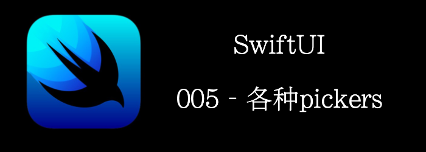

pickers是用来提供给用户选择某个值的。
本文将介绍以下的pickers
- **Picker**
- **Toggle**
- **Slider**
- **Stepper**
- **DatePicker**
- **ColorPicker**
<!--truncate-->
## Getting ready

首先，新建一个SwiftUI工程，叫做**PickersApp**。

## How to do it…

1. 在**ContentView.swift**创建好State，以绑定各个pickers的value。
```swift
@State var choice = 0
@State var showText = false
@State var transitModes = ["Bike", "Car", "Bus"]
@State var sliderVal: Float = 0
@State var stepVal = 0
@State var gameTime = Date()
```

2. 在Body中加入一个`Form`、`Section`、`Picker`。
```swift
struct ContentView: View {
    @State var choice = 0
    @State var showText = false
    @State var transitModes = ["Bike", "Car", "Bus"]
    @State var sliderVal: Float = 0
    @State var stepVal = 0
    @State var gameTime = Date()
    
    var body: some View {
        Form {
            Section {
                Picker("Transit Modes", selection: $choice) {
                    ForEach(0..<transitModes.count) { index in
                        Text("\(self.transitModes[index])")
                    }
                }.pickerStyle(.segmented)
                Text("Current choice: \(self.transitModes[choice])")
            }
        }
    }
}
```

3. 再添加一个section，加入`Toggle`
```swift
Section {
    Toggle(isOn: $showText) {
        Text("Show Text")
    }
    if showText {
        Text("The Text toggle is on")
    }
}
```

4. 再添加一个section，加入`Slider`
```swift
Section {
	Slider(value: $sliderVal, in: 0...10, step: 0.001)
	Text("Slider current value\(sliderVal, specifier: "%.1f")")
}
```

5. 再添加一个section，加入`Stepper`
```swift
Section {
    Stepper("Stepper", value: $stepVal, in: 0...5)
    Text("Stepper current value\(stepVal)")
}
```

6. 再添加一个section，加入`DatePicker`
```swift
 Section {
	DatePicker("Please select a date", selection: $gameTime)
}
```

7. 再添加一个section，加入`DatePicker`,再限制下时间范围

```swift
Section {
  DatePicker("select a date", selection: $gameTime, in: Date()...)
}
```

最终如下


## How it works…

`Picker`是用来从一组值中选择某一个的，设置style为Segmented就得到了一个UIKit的SegmentView。

`Toggle`控制开和关，当前状态存储在binding的vlaue中。

`Slider`需要3个参数: 

- **value**: 当前值
- **in**： slider的范围
- **step**： 步进的值

`Stepper`也同Slider一样需要那3个参数。

最后演示了一下DatePicker的使用，注意binding的类型是date。

> picker的style会根据他的容器不同而不同。比如在Form或者List中的picker会和在VStack中的不一样。
>
> 我们可以通过`.pickerStyle`来修改默认style。

## Api详情

### Picker

#### Creating a Picker

```swift
///SelectionValue遵循Hashable， Content和Label都遵循View
init(selection: Binding<SelectionValue>, content: () -> Content, label: () -> Label)
```

> 注意Picker的每个选项都需要带上tag，而且tag的值和类型要和Binding的变量一样。

```swift
enum Flavor: String, CaseIterable {
    case chocolate
    case vanilla
    case strawberry
}
struct ContentView: View {
    @State var selectedFlavor: Flavor = .chocolate
    var body: some View {
        Form {
            Section {
                Picker("Flaver", selection: $selectedFlavor) {
                   //注意需要标上tag，而且类型需要和Binding的一样
                    Text("\(Flavor.chocolate.rawValue)").tag(Flavor.chocolate)
                    Text("\(Flavor.vanilla.rawValue)").tag(Flavor.vanilla)
                    Text("\(Flavor.strawberry.rawValue)").tag(Flavor.strawberry)
                }.pickerStyle(.segmented)
                Text("Current Flaver: \(selectedFlavor.rawValue)")
            }    
        }
    }
}
```

可能有人就有疑问了，为什么在`how to do`那里的Picker的例子就没有打tag呢？

因为ForEach会自动为你打tag，这个tag的值是遵循了`Identifiable`协议的对象的id字段。所以之前的那个例子不用显示的带上tag。如果我们要改写上面的例子用ForEach实现呢？

```swift
///遵循Identifiable协议
enum Flavor: String, CaseIterable, Identifiable {
    case chocolate
    case vanilla
    case strawberry
    var id: Flavor { self }
}
struct ContentView: View {
    @State var selectedFlavor: Flavor = .chocolate
    var body: some View {
        Form {
            Section {
                Picker("Flaver", selection: $selectedFlavor) {
                    // 不用显示的打tag，默认用id作为tag，id和Binding都是Flavor类型的
                    // 当然，如果你愿意，也可以自己显示的指定tag
										ForEach(Flavor.allCases) { flavor in
                        Text("\(flavor.rawValue)")
                    }
                }.pickerStyle(.segmented)
                Text("Current Flaver: \(selectedFlavor.rawValue)")
            }    
        }
    }
}
```

#### Styling Pickers

```swift
/// 设置picker的样式
func pickerStyle<S>(_ style: S) -> some View where S : PickerStyle
```

```swift
//segment样式
static var segmented: SegmentedPickerStyle { get }
```

```swift
//类似于UIPicker的那种滚轮样式
static var wheel: WheelPickerStyle { get }
```


```swift
//macOS上的勾选样式
static var radioGroup: RadioGroupPickerStyle { get }
```

```swift
//菜单，类似于UIPopoverController，点了出现小弹窗，包含所有选项
static var menu: MenuPickerStyle { get }
```


```swift
//所有选项都同时显示出来，
static var inline: InlinePickerStyle { get }
```


### Toggle

#### Creating a Toggle

```swift
init(isOn: Binding<Bool>, label: () -> Label)
...
```

#### Creating a Toggle from a Configuration

```swift
//通常用在自定义ToggleStyle中
init(_ configuration: ToggleStyleConfiguration)
```

举个例子

```swift
struct RedBorderToggleStyle: ToggleStyle {
    func makeBody(configuration: Configuration) -> some View {
        Toggle(configuration)//通过cinfiguration初始化
            .padding()
            .border(Color.red)
    }
}

Toggle(isOn: $showText) {
      Text("Show Text")
}.toggleStyle(RedBorderToggleStyle())
```

#### Styling a Toggle

```swift
func toggleStyle<S>(_ style: S) -> some View where S : ToggleStyle
```

下面是一些默认的style

```swift
/// switch样式
static var `switch`: SwitchToggleStyle { get }
```

```swift
/// label作为btn, on的时候，背景设为tintColor
static var button: ButtonToggleStyle { get }
```


```swift
/// 勾选框，只有macOS有
static var checkbox: CheckboxToggleStyle { get }
```


### Slider

```swift
/**
value : binding的值
bounds: 值的范围
step: 步进的大小
label: 描述的view
minimumValueLabel
maximumValueLabel最大和最小端的view
*/
init<V>(value: Binding<V>, in bounds: ClosedRange<V>, step: V.Stride = 1, label: () -> Label, minimumValueLabel: () -> ValueLabel, maximumValueLabel: () -> ValueLabel, onEditingChanged: @escaping (Bool) -> Void = { _ in }) where V : BinaryFloatingPoint, V.Stride : BinaryFloatingPoint
```

### Stepper

#### Creating a Stepper 

```swift
/**
value : binding的值
bounds: 值的范围
step: 步进的大小
label: 描述的view
*/
init<V>(value: Binding<V>, in bounds: ClosedRange<V>, step: V.Stride = 1, label: () -> Label, onEditingChanged: @escaping (Bool) -> Void = { _ in }) where V : Strideable
```

#### Creating a Stepper with Specified Increment and Decrement Behavior

```swift
// 不在和某个value绑定，将两个按钮的事件暴露出来，提供给你自定义你的逻辑
init(label: () -> Label, onIncrement: (() -> Void)?, onDecrement: (() -> Void)?, onEditingChanged: @escaping (Bool) -> Void = { _ in })
```

### DatePicker

#### Creating a Date Picker

```swift
init(selection: Binding<Date>, displayedComponents: DatePicker<Label>.Components = [.hourAndMinute, .date], label: () -> Label)
/// 可以指定range, start...end
init(selection: Binding<Date>, in range: ClosedRange<Date>, displayedComponents: DatePicker<Label>.Components = [.hourAndMinute, .date], label: () -> Label)
/// 可以指定range, start...
init(selection: Binding<Date>, in range: PartialRangeFrom<Date>, displayedComponents: DatePicker<Label>.Components = [.hourAndMinute, .date], label: () -> Label)
/// 可以指定range, ...end
init(selection: Binding<Date>, in range: PartialRangeThrough<Date>, displayedComponents: DatePicker<Label>.Components = [.hourAndMinute, .date], label: () -> Label)
```

#### Setting Date Picker Components

```swift
//设置显示的components
static let date: DatePickerComponents// 年月日
static let hourAndMinute: DatePickerComponents//小时，分钟
```

#### Styling Date Pickers

```swift
///设置picker样式
func datePickerStyle<S>(_ style: S) -> some View where S : DatePickerStyle
```

```swift
static var wheel: WheelDatePickerStyle { get }
```


```swift
/// macOS上特有的，类似于Stepper
static var stepperField: StepperFieldDatePickerStyle { get }
/// macOS上特有的
static var field: FieldDatePickerStyle { get }
```

```swift
static var graphical: GraphicalDatePickerStyle { get }
```


```swift
///component以文本格式显示
static var compact: CompactDatePickerStyle { get }
```


### ColorPicker

选择颜色

```swift
///绑定Color
init(selection: Binding<Color>, supportsOpacity: Bool = true, label: () -> Label)
///绑定CGColor
init(selection: Binding<CGColor>, supportsOpacity: Bool = true, label: () -> Label)
```

```swift
ColorPicker(selection: $color) {
	Text("选择颜色")
}
```


