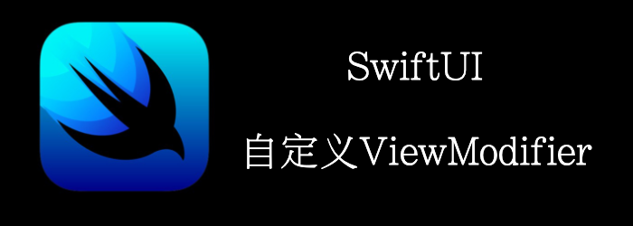

SwiftUI为你提供了自定义modifiers的能力。
你可以使用自定义modifiers将多个modifiers合成一个。
本章我们将创建一个自定义modifier，他能够为TextView添加圆角和背景。
<!--truncate-->

## Getting ready

新建一个SwiftUI工程**UsingViewModifiers**。

## How to do it…

1. 修改**ContentView**中的text为**Perfect**。

```swift
Text("Perfect")
```

2. 在**ContentView.swift**中，新建一个struct，遵循**ViewModifier**，接受一个参数**Color**。

```swift
struct BackgroundStyle: ViewModifier {
    var bgColor: Color
    func body(content: Content) -> some View{
        content
        .frame(width:UIScreen.main.bounds.width * 0.3)
        .foregroundColor(Color.black)
        .padding()
        .background(bgColor)
        .cornerRadius(CGFloat(20))
    }
}
```

3. 为Text添加一个**modifier**。
```swift
Text("Perfect").modifier(BackgroundStyle(bgColor:.blue))
```

4. 当然，如果你不想用**modifier**, 可以添加一个extension。
```swift
extension View {
    func backgroundStyle(color: Color) -> some View{
        self.modifier(BackgroundStyle(bgColor: color))
    }
}
```

5. 将我们的modifier修改为刚刚的extension
```swift
Text("Perfect").backgroundStyle(color: Color.red)
```


## How it works…

一个 **ViewModifier**通过修改原来修饰的View来创建一个新的View  。

通过通过遵循ViewModifier协议来创建一个自定义modifier。

通过.modifier()来应用我们自定义的modifier。

通过extension来添加更方便的Api。

