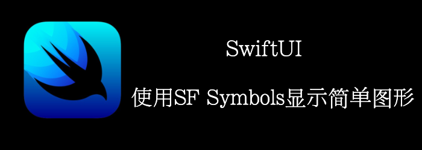

SF Symbols提供了超过3200种Symbols。

你可以在官网下载macOS app：[SF-Symbols-3.dmg](https://developer.apple.com/sf-symbols/)，然后再App上浏览各种SF symbols。

本章我们将在label和Image中使用SF symbols，并使用modifier来修改symbles。
<!--truncate-->
## Getting ready

首先，新建一个SwiftUI项目**UsingSFSymbols**。

## How to do it…

1. 打开ContentView.swift，替换默认的Text为以下代码
```swift
VStack {
    HStack {
        Image(systemName: "c")
        Image(systemName: "o")
        Image(systemName: "o")
        Image(systemName: "k")
    }.symbolVariant(.circle.fill)
        .foregroundStyle(.yellow, .blue)
        .font(.title)
}
```

2. 再添加一个HStack

```swift
HStack {
    Image(systemName: "b.circle.fill")
    Image(systemName: "o.circle.fill").foregroundColor(.red)
    Image(systemName: "o.circle.fill").imageScale(.large)
    Image(systemName: "k.circle.fill").accessibilityIdentifier("letter k")
}.symbolVariant(.circle.fill)
    .foregroundColor(Color.blue)
    .font(.title)
    .padding()

```

3. 再添加一个HStack

```swift
HStack{
    Image(systemName: "allergens")
    Image(systemName: "ladybug")
}.symbolVariant(.fill)
    .symbolRenderingMode(.multicolor)
    .font(.largeTitle)
```

4. 最后，我们再添加一个Toggle
```swift
Toggle(isOn: $wifi_on) {
    Label("Wifi", systemImage: "wifi")
}.foregroundStyle(wifi_on ? .blue : .secondary)
    .padding()
```

最终结果


## How it works…

SF Symbols 定义了一些变体，比如`enclosed`,`fill`,`slash`。这些不同的变体能够传达不同的信息，比如Wi-Fi symbol 加上slash，能够表达wifi不可用。

在我们的第一个HStack中，我们使用了 **.symbolVariant(.fill.circle)** 来将 **.fill** 和 **.circle** 应用到HStack中的所有items上。这也能通过如下代码实现：

```swift
HStack{         
 	Image(systemName: "c.circle.fill")
  Image(systemName: "o.circle.fill ")
  Image(systemName: "o.circle.fill ")
  Image(systemName: "k.circle.fill ")     
}
```

然而，这个代码不太灵活，我们可能只需要**.circle** 或者 **.fill** ，或者都不需要。

我们也注意到了 **HStack** 中的 .**foregroundStyle(...)** 。他能接受1个、2个或者3个参数，分别设置primary, secondary, 和 tertiary colors。有的symbols可能会同时包含这3种颜色，或者primary+secondary，或者primary+tertiary。

第二个HStack也有 **.symbolVariant** , 不过只有1个变体。同时我们看到了一个新的modifier: **.symbolRenderingMode()**。Rendering modes能够控制颜色如何应用到symbols上。multicolor rendering mode 将symbols渲染为多层样式。 添加 **.multicolor** rendering mode足够展示symbol的默认layer colors了。 其他的 rendering modes 有 **hierarchical**, **monochrome**, 和 **palette**。

最终, 我们创建了一个wifi toggle，我们可以根据wifi的状态来改变symbol的颜色。

## SymbolVariants

来看看当前都有些什么SymbolVariants

```swift
//没有Variant
static let none: SymbolVariants
//圆圈
static let circle: SymbolVariants
//正方形
static let square: SymbolVariants
//长方形
static let rectangle: SymbolVariants
//填充
static let fill: SymbolVariants
//斜线
static let slash: SymbolVariants
```


```swift
VStack(spacing: 20) {
    HStack(spacing: 20) {
        Image(systemName: "flag")
        Image(systemName: "heart")
        Image(systemName: "bolt")
        Image(systemName: "star")
    }
    HStack(spacing: 20) {
        Image(systemName: "flag")
        Image(systemName: "heart")
        Image(systemName: "bolt")
        Image(systemName: "star")
    }
    .symbolVariant(.circle)
}
```


```swift
VStack(spacing: 20) {
    HStack(spacing: 20) {
        Image(systemName: "flag")
        Image(systemName: "heart")
        Image(systemName: "bolt")
        Image(systemName: "star")
    }
    HStack(spacing: 20) {
        Image(systemName: "flag")
        Image(systemName: "heart")
        Image(systemName: "bolt")
        Image(systemName: "star")
    }
    .symbolVariant(.square)
}
```


```swift
VStack(spacing: 20) {
    HStack(spacing: 20) {
        Image(systemName: "plus")
        Image(systemName: "minus")
        Image(systemName: "xmark")
        Image(systemName: "checkmark")
    }
    HStack(spacing: 20) {
        Image(systemName: "plus")
        Image(systemName: "minus")
        Image(systemName: "xmark")
        Image(systemName: "checkmark")
    }
    .symbolVariant(.rectangle)
}
```


```swift
VStack(spacing: 20) {
    HStack(spacing: 20) {
        Image(systemName: "flag")
        Image(systemName: "heart")
        Image(systemName: "bolt")
        Image(systemName: "star")
    }
    HStack(spacing: 20) {
        Image(systemName: "flag")
        Image(systemName: "heart")
        Image(systemName: "bolt")
        Image(systemName: "star")
    }
    .symbolVariant(.fill)
}
```


```swift
VStack(spacing: 20) {
    HStack(spacing: 20) {
        Image(systemName: "flag")
        Image(systemName: "heart")
        Image(systemName: "bolt")
        Image(systemName: "star")
    }
    HStack(spacing: 20) {
        Image(systemName: "flag")
        Image(systemName: "heart")
        Image(systemName: "bolt")
        Image(systemName: "star")
    }
    .symbolVariant(.slash)
}
```


