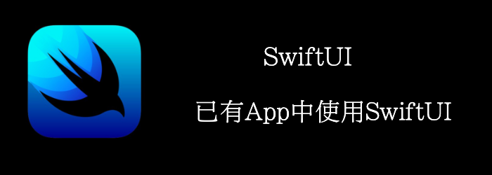

本章，我们将学习如何从 UIKit 视图跳转到 SwiftUI 视图，同时将文本传递给我们的 SwiftUI 视图。
<!--truncate-->
## Getting ready

新建一个普通Storyboard工程。

## How to do it…

1. 选中Main.stroyboard。
2. 选中**ViewController**
3. 在菜单中选择 **Editor** | **Embed in** | **Navigation Controller**.
4. 选择右上角的+号，添加一个**Hosting View Controller**到storyboard里
5. 添加一个Button到ViewController中，添加点击btn跳转到HostingViewController
6. 拖动segue到ViewController中，取名为gotoSwiftUI
```swift
    @IBSegueAction func gotoSwiftUI(_ coder: NSCoder) -> UIViewController? {
        return UIHostingController(coder: coder, rootView: rootView)
    }

```

7. 添加import SwiftUI
```swift
import SwiftUI
```

8. 在gotoSwiftUI中创建rootView
```swift
@IBSegueAction func gotoSwiftUI(_ coder: NSCoder) -> UIViewController? {
  let greetings = "Hello From UIKit"
	let rootView = Greetings(textFromUIKit:greetings)
  return UIHostingController(coder: coder, rootView: rootView)
}
```

9. 新建一个SwiftUI View, 取名**Greetings**
10. 实现Greetings
```swift
struct Greetings: View {
    var textFromUIKit = ""
    var body: some View {
        Text(textFromUIKit)
    }
}
```

最终，点击button，就能够跳转到Greetings，并显示传过去的参数


## How it works…

为了在普通项目中显示SwiftUI，你需要将SwiftUI视图包裹到一个**ViewController** 或者 **InterfaceController**中。

我们添加了**UIHostingController**作为SwiftUI的容器。
