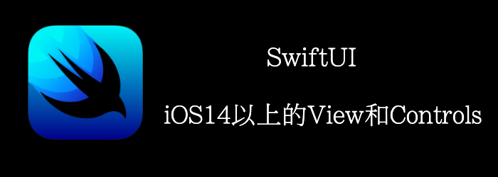

本章我们将查看

- **ProgressView**
- **ColorPicker**
- **Link**
- **Menu**

ProgressView用于显示任务的完成程度。有两种类型的ProgressView：不确定的进度视图显示一个旋转的圆圈直到任务完成，而确定的进度视图显示一个被填满的bar，以显示任务的完成程度。

ColorPicker视图允许用户从多种颜色中进行选择。

Menu视图则显示一个items列表，用户可以从中选择以执行特定操作。
<!--truncate-->
## Getting ready

新建一个SwiftUI项目，**MoreViewsAndControls**

## How to do it…

1. 首先，添加一些状态
```swift
@State private var progress = 0.5
@State private var color  = Color.red
@State private var secondColor  = Color.yellow
@State private var someText = "Initial value"
```

2. 添加一个List， 在添加一个包含ProgressView的Section
```swift
List {
    Section(header: Text("ProgressViews")) {
        ProgressView("Indeterminate progressview")
        ProgressView("Downloading",value:progress, total:2)
        Button("More"){
            if(progress < 2){
                progress += 0.5
            }
        }
    }
}
```

3. 再添加另一个Section
```swift
	Section(header: Text("Labels")) {
    Label("Slow", image: "tortoise.fill")
    Label {
        Text("Fast").font(.title)
    } icon: {
        Circle()
            .fill(.orange)
            .frame(width: 40, height: 20, alignment: .center)
            .overlay {
                Text("F")
            }
    }
}
```

4. 在添加2个Section，包含**ColorPicker**和Link
```swift
Section(header: Text("ColorPicker")) {
    ColorPicker(selection: $color) {
        Text("Pick my background").background(color).padding()
    }
    ColorPicker("Picker", selection: $secondColor)
}
Section(header: Text("Link")) {
  Link("Packt Publishing", destination: URL(string: "https://www.baidu.com")!)
}
```

5. 再添加一个Section，包含TextEditor
```swift
Section(header: Text("TextEditor")) {
    TextEditor(text: $someText)
    Text("current editortext:\n\(someText)")
}
```

6. 再添加一个Section，包含Menu
```swift
Section(header: Text("Menu")) {
    Menu("Actions") {
        Button("set TextEditor text to 'magic'") {
            someText = "magic"
        }
        Button("turn first color green") {
            color = .green
        }
        Menu("Actions") {
            Button("set TextEditor text to 'number'") {
                someText = "number"
            }
            Button("turn first color red") {
                color = .red
            }
        }
    }
}
```

7. 最终，我们修改下List的显示样式
```swift
List {

...

}.listStyle(.grouped)
```

最终


## How it works…

不确定进度的进度条，不需要参数

```swift
ProgressView("Indeterminate progress view")
ProgressView()
```

确定进度的，需要提供，当前进度和总进度, 总进度不传的话默认为1.

```swift
ProgressView("Downloading",value: progress, total:2)
```

Label显示一个text和icon，我们可以使用SF symbol。

ColorPicker能够让用户选择颜色

Link用于显示一个可以点击的链接

**Menu**提供了弹窗供用户选择选项，可以添加多级，但不建议嵌套太深。

## Api详情

### ProgressView

#### Creating Progress View

```swift
//不确定进度的
init(label: () -> Label)
//确定进度的
init<V>(value: V?, total: V = 1.0, label: () -> Label) where CurrentValueLabel == EmptyView, V : BinaryFloatingPoint
//通过config初始化，通常用在自定义style中
init(_ configuration: ProgressViewStyleConfiguration) where Label == ProgressViewStyleConfiguration.Label, CurrentValueLabel == ProgressViewStyleConfiguration.CurrentValueLabel
//比如
struct DarkBlueShadowProgressViewStyle: ProgressViewStyle {
    func makeBody(configuration: Configuration) -> some View {
        ProgressView(configuration)
            .shadow(color: Color(red: 0, green: 0, blue: 0.6),
                    radius: 4.0, x: 1.0, y: 2.0)
    }
}
```

#### Styling Progress Views

```swift
func progressViewStyle<S>(_ style: S) -> some View where S : ProgressViewStyle
//直线
static var linear: LinearProgressViewStyle { get }
//运行看效果似乎是和不确定进度的那种小菊花一样，看不到进度的改变
static var circular: CircularProgressViewStyle { get }
```

### Label

#### Creating a Label from Text and an Image

```swift
//title + 本地image
init<S>(_ title: S, image name: String) where S : StringProtocol
```

#### Creating a Label from Text and an SF Symbol

```swift
//title + sf symbol
init<S>(_ title: S, systemImage name: String) where S : StringProtocol
```

#### Creating a Label from a Title and Icon

```swift
//title + Icon
init(title: () -> Title, icon: () -> Icon)
```

#### Creating a Label from a Configuration

```swift
init(_ configuration: LabelStyleConfiguration)
//比如
struct RedBorderedLabelStyle: LabelStyle {
    func makeBody(configuration: Configuration) -> some View {
        Label(configuration)
            .border(Color.red)
    }
}
```

#### Styling Labels

```swift
func labelStyle<S>(_ style: S) -> some View where S : LabelStyle
//只显示图片
static var iconOnly: IconOnlyLabelStyle { get }
//title + icon
static var titleAndIcon: TitleAndIconLabelStyle { get }
//只显示title
static var titleOnly: TitleOnlyLabelStyle { get }
```

### Link

```swift
// 显示的title 和跳转的url
init(destination: URL, label: () -> Label)
```

### Menu

#### Creating a Menu from Content

```swift
//点击后出现content中的选项
init(content: () -> Content, label: () -> Label)
```

#### Creating a Menu with a Primary Action

```swift
//普通点击会触发primaryAction，如果长按或者双击则显示content中的选项
init(content: () -> Content, label: () -> Label, primaryAction: @escaping () -> Void)
```

#### Creating a Menu from a Configuration

```swift
init(_ configuration: MenuStyleConfiguration)
//比如
struct RedBorderMenuStyle: MenuStyle {
    func makeBody(configuration: Configuration) -> some View {
        Menu(configuration)
            .border(Color.red)
    }
}
```

#### Styling a Menu

```swift
func menuStyle<S>(_ style: S) -> some View where S : MenuStyle
//默认的
struct DefaultMenuStyle
//无边框button
struct BorderlessButtonMenuStyle
//有边框，只能macOS用
struct BorderedButtonMenuStyle
```
