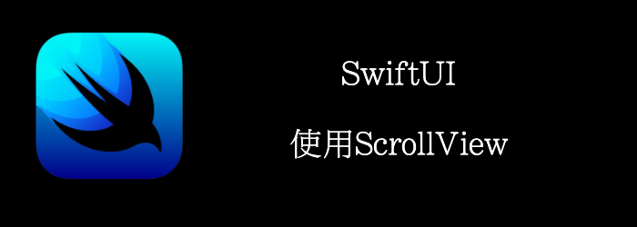

当要显示的内容无法放入其容器时, 你可以使用ScrollView。

滚动视图默认是垂直的，但也可以设置为水平的。

本章我们将学习如何创建水平和垂直的ScrollView
<!--truncate-->
## Getting ready

新建一个SwiftUI项目**WeScroll**

## How to do it…

我们将创建一个显示字母A-P的ScrollView。

1. 添加我们需要的字母到contentView中
```swift
let letters = ["a","b","c","d","e","f","g","h","i","j","k","l","m","n","o","p"]
```

2. 替换ContentView为以下内容
```swift
struct ContentView: View {
    let letters = ["a","b","c","d","e","f","g","h","i","j","k","l","m","n","o","p"]
    var body: some View {
        VStack {
            ScrollView(.vertical, showsIndicators: true) {
                ForEach(self.letters, id: \.self) { letter in
                    Image(systemName: letter)
                        .font(.largeTitle)
                        .foregroundColor(.yellow)
                        .background(Color.blue)
                        .frame(width: 50, height: 50, alignment: .center)
                        .symbolVariant(.circle.fill)
                }
            }.frame(width: 50, height: 200, alignment: .center)
            
            ScrollView(.horizontal, showsIndicators: true) {
                HStack {
                    ForEach(self.letters, id: \.self) { letter in
                        Image(systemName: letter)
                            .font(.largeTitle)
                            .foregroundColor(.yellow)
                            .background(Color.blue)
                            .frame(width: 50, height: 50, alignment: .center)
                            .symbolVariant(.circle.fill)
                    }
                }
            }
        }
    }
}
```

最终得到


## How it works…

默认情况下，ScrollView是垂直滚动的。

这里我们使用了ForEach来将我们的集合数据转化成Views。

我们给ForEach传递了2个参数，第一个是需要迭代的collection，第二个是id。id帮助我们区别每个item，他们应该是唯一的。因为我们集合中的每个字母是唯一的，因此可以使用.self作为id。

如果你的item遵循**Identifiable**协议，就不用提供id参数，会使用Identifiable的id作为id。

第二个scrollview指定了滚动方向为水平，要显示滚动条，要水平显示内容，我们用HStack让字母水平排列。

## Api详情

### ScrollView

#### Creating a Scroll View

```swift
//可以水平，垂直，或者两个一起滚动。
init(_ axes: Axis.Set = .vertical, showsIndicators: Bool = true, content: () -> Content)
```

