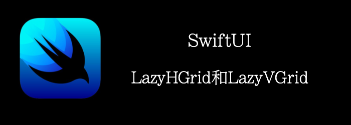

和Lazy stack一样，lazy grid也使用lazy loading来显示一系列的items。items只会在即将出现在屏幕上时才会初始化。

从上到下的使用LazyVGrid， 从左到右的使用LazyHGrid。
<!--truncate-->
## Getting ready

我们创建一个新项目**LazyGrids**

## How to do it…

1. 首先在ContentView中创建LazyVGrid的布局信息， **GridItem**用来帮助配置lazy grid的布局
```swift
let coulumSpe = [GridItem(.adaptive(minimum: 100))]
```

2. 创建LazyHGrid的布局信息

```swift
let rowSpec = [GridItem(.flexible()),
                   GridItem(.flexible()),
                   GridItem(.flexible())]
```

3. 准备个颜色数组，之后用在item上
```swift
let colors: [Color] = [.green, .red, .yellow, .blue]
```

4. 替换原来的Text为VStack， ScrollView，**LazyVGrid**
```swift
VStack {
  ScrollView {
      LazyVGrid(columns: coulumSpe, spacing: 20) {
          ForEach(1 ... 999, id: \.self) { index in
              Text("Item \(index)")
                  .padding(EdgeInsets(top: 30,leading: 15, bottom: 30, trailing: 15))
                  .background(colors[index % colors.count])
                  .clipShape(Circle())
                  .border(Color.red)
          }
      }
  }
}
```

5. 在来一个ScrollView显示LazyHGrid，注意调整scrollview方向

```swift
ScrollView(.horizontal) {
    LazyHGrid(rows: coulumSpe, spacing: 20) {
        ForEach(1 ... 999, id: \.self) { index in
            Text("Item \(index)")
                .foregroundColor(.white)
              .padding(EdgeInsets(top: 30,leading: 15, bottom: 30, trailing: 15))
                .background(colors[index % colors.count])
                .clipShape(Capsule())
        }
    }
}
```

最终结果:


## How it works…

 lazy grid最基本的用法就是ScrollView中嵌套**LazyVGrid** 或者 **LazyHGrid**

```swift
ScrollView {
    LazyHGrid(columns: columnsSpec) {
        // Items to be displayed
    }
}
```

其中最重要的是要理解如何定义行和列。比如上面的，我们的**LazyVGrid**只定义了包含一个**GridItem**的数组，但是却显示了3列。这是怎么回事？原因在于**GridItem**是如何定义的。我们定义**GridItem(.adaptive(minimum: 100))**，就是告诉SwiftUI每个item至少100宽，然后一行尽可能多的放置Item，因此每一行的个数可能在横屏和竖屏下不一样。

如果你想指定每一行的个数，你可以使用 **GridItem(.flexible())**。就像我们上面定义的

```swift
let rowSpec = [
    GridItem(.flexible()),
    GridItem(.flexible()),
    GridItem(.flexible())
]
```

添加3个flexible的GridItem会将可用 空间3等分。然后用那段空间显示，如果空间用不完，那么就是空白。

## Api详情

### LazyVGrid

```swift
//注意有个pinnedViews，和LazyVStack一样，可以设置一直悬浮的header/footer
init(columns: [GridItem], alignment: HorizontalAlignment = .center, spacing: CGFloat? = nil, pinnedViews: PinnedScrollableViews = .init(), content: () -> Content)
```

```swift
LazyVGrid(columns: coulumSpe, spacing: 20, pinnedViews: .sectionHeaders) {
    Section(header: Text("this is section header")) {
        ForEach(1 ... 999, id: \.self) { index in
            Text("Item \(index)")
                .padding(EdgeInsets(top: 30,leading: 15, bottom: 30, trailing: 15))
                .background(colors[index % colors.count])
                .clipShape(Circle())
                .border(Color.red)
        }
    }
}
```


### LazyHGrid

```swift
//注意有个pinnedViews，和LazyVStack一样，可以设置一直悬浮的header/footer
init(rows: [GridItem], alignment: VerticalAlignment = .center, spacing: CGFloat? = nil, pinnedViews: PinnedScrollableViews = .init(), content: () -> Content)
```

