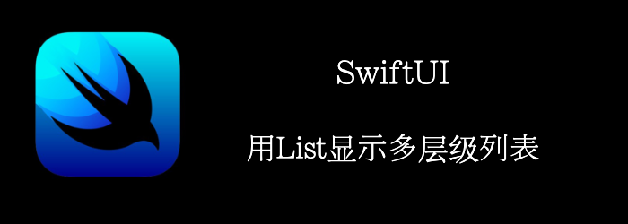

我们可以用展开收起的列表来展示层级。
<!--truncate-->
## Getting ready

首先，创建一个新项目：**ExpandingLists**

## How to do it…

1. 首先，定义一个多层数据结构
```swift
struct Backpack: Identifiable {
    let id = UUID()
    let name: String
    let icon: String
    var content: [Backpack]?
}
```

2. 准备数据
```swift
let dollar = Backpack(name: "Dollar", icon: "dollarsign.circle")
let yen = Backpack(name: "Yen",icon: "yensign.circle")
let currencies = Backpack(name: "Currencies", icon: "coloncurrencysign.circle", content: [dollar, yen])

let pencil = Backpack(name: "Pencil",icon: "pencil.circle")
let hammer = Backpack(name: "Hammer",icon: "hammer")
let paperClip = Backpack(name: "Paperclip",icon: "paperclip")
let glass = Backpack(name: "Magnifying glass", icon: "magnifyingglass")
let bin  = Backpack(name: "Bin", icon: "arrow.up.bin", content: [paperClip, glass])
let tools = Backpack(name: "Tools", icon: "folder", content: [pencil, hammer,bin])
```

3. 在contentView中定义数据
```swift
struct ContentView: View {
    let bagContents = [currencies,tools]
}
```

4. 显示数据
```swift
var body: some View {
    List(bagContents, children: \.content){ row in
        Image(systemName: row.icon)
        Text(row.name)
    }
}
```

最终结果:


## How it works…

首先我们定义了**Backpack**，拥有嵌套结构，能表示多个层级。

我们显示List时，指定children为content字段。

```swift
List(bagContents, children: \.content){ row in
    Image(systemName: row.icon)
    Text(row.name)
}
```

