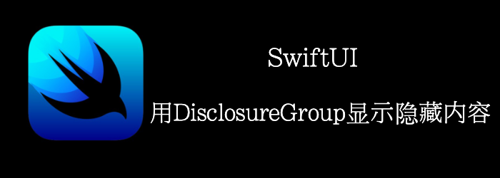

**DisclosureGroup**根据disclosure control状态来控制显示和隐藏的一个视图。

需要两个参数：标识其content的**label**， 以及控制content是可见还是隐藏的**binding**。

我们创建一个例子来仔细看看它是如何工作的。
<!--truncate-->
## Getting ready

首先，新建一个工程**DisclosureGroups**

## How to do it…

1. 首先，创建一个State
```swift
@State private var showplanets = true
```

2. 修改默认的Text为 **List** 和 **DisclosureGroup**
```swift
List {
    DisclosureGroup("Planets", isExpanded: $showplanets) {
        Text("Mercury")
        Text("Venus")
    }
}
```

3. 再嵌套一个
```swift
var body: some View {
        List {
            DisclosureGroup("Planets", isExpanded: $showplanets) {
                Text("Mercury")
                Text("Venus")
                DisclosureGroup("Earth") {
                    Text("North America")
                    Text("South America")
                    Text("Europe")
                    Text("Africa")
                    Text("Asia")
                    Text("Antarctica")
                    Text("Oceania")
                }
            }
        }
    }
```

运行，最终结果


## How it works…

我们通过showplanets 控制**DisclosureGroup** content的显示和隐藏。

**DisclosureGroup** 是能够嵌套的，用于显示多个层级。

DisclosureGroup也能脱离List单独使用。
