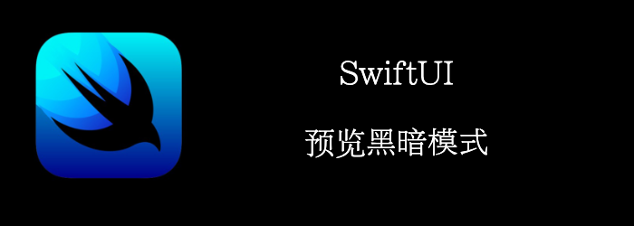

SwiftUI内置支持黑暗模式。你只需要修改预览的设置，就能预览黑暗模式。
接下来我们将通过一个简单的例子演示一下。
<!--truncate-->
## Getting ready

创建个新的SwiftUI工程：**DarkModePreview**

## How to do it

自从 SwiftUI 出现以来，预览就存在一个问题，您无法在黑暗模式下预览任何视图，除非视图包含在**NavigationView 中**。这是一个功能还是一个错误？希望我们能在下一版 SwiftUI 中得到答案。

我们将在**NavigationView 中**包含一个**Text**，并在light和dark模式下预览它。步骤如下：

1. 打开ContentView.swift
2. 添加一个环境变量
```swift
@Environment(\.colorScheme) var deviceColorScheme
```

3. 添加一个NavigationView
```swift
NavigationView {
    Text(deviceColorScheme == .dark ? "Quick journey to the dark side" : "Back to the light")
}

```

4. 在**Content_Previews**中添加一个**colorScheme**
```swift
struct ContentView_Previews: PreviewProvider {
    static var previews: some View {
        Group {
            ContentView().colorScheme(.dark)
            ContentView().colorScheme(.light)
        }
    }
}
```

此时能够在preview中查看到：


## How it works

在黑暗模式下预览内容的过程是不言自明的。预览显示来自**ContentView**视图的内容。如果未向预览提供配色方案，则使用**.light**作为默认配色方案。

为了在明暗模式下显示不同的文本，我们添加了一个**deviceColorScheme**环境变量。然后，我们在**Text**视图中使用三元运算符将其值更改**为在**检测到深色方案时显示**Quick journey to the dark side**，并在检测到浅色方案时 **Back to the light**。
