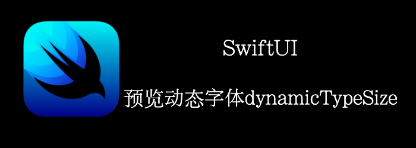

您可能希望改进应用的一些功能以吸引更多的用户 。比如：用户可能喜欢的不同字体，这意味着要确保设计在不同字体大小下看起来不错。SwiftUI 预览非常适合此类情况。它们允许您立即预览新内容在不同动态字体大小下的外观。
我们来编写一个新闻类文章demo。
<!--truncate-->
## Getting ready

创建一个新的SwiftUI工程：**DynamicTypeSizesPreview**。

## How to do it

一个新闻类文章应该包含一个图片，一个title，和一段描述。我们首选创建一个model来代表一个新闻，然后创建一个View来显示他，最后在不同大小的设备上预览。

1. 我们把两个图片放到Preview Content下的xcassets下


2. 新建一个文件**Article**，定义model
```swift
struct Article {
    var imageName:String
    var title: String
    var description: String
}
```

3. 在Article定义的下方，我们创建点数据用于预览
```swift
let sampleArticle1 = Article(imageName: "reading", title: "Love reading", description: "Reading is essential to success")
let sampleArticle2 = Article(imageName: "naptime", title: "Nap time", description: "Take naps when tired to improve performance")
```

4. 新建一个SwiftUI view： **ArticleView**
```swift
struct ArticleView: View {
    var article: Article
    var body: some View {
        HStack {
            Image(article.imageName)
                .resizable()
                .aspectRatio(contentMode: .fit)
                .frame(width: 150, height: 100)
                .clipShape(Ellipse())
            VStack {
                Text(article.title)
                    .font(.title)
                Text(article.description)
                    .padding()
            }
        }
    }
}
```

5. preview中传入我们的demo数据
```swift
struct ArticleView_Previews: PreviewProvider {
    static var previews: some View {
        ArticleView(article: sampleArticle1)
    }
}
```

预览就得到：


6. 换个预览数据
```swift
struct ArticleView_Previews: PreviewProvider {
    static var previews: some View {
        ArticleView(article: sampleArticle2)
    }
}
```


7. 好了，我们将ArticleView添加到ContentView中
```swift
struct ContentView: View {
    var body: some View {
        ArticleView(article: sampleArticle1)
    }
}
```

8. 在ContentView_Previews添加个Group同时预览多个View
```swift
struct ContentView_Previews: PreviewProvider {
    static var previews: some View {
        Group {
            ContentView()
            ContentView().environment(\.dynamicTypeSize, .xSmall)
        }
    }
}
```

9. 现在我们显示了2个device，不过都是全屏，我们要查看全部的话，需要滚动很长，我们希望只包含View那么大
```swift
struct ContentView_Previews: PreviewProvider {
    static var previews: some View {
        Group {
            ContentView()
            ContentView().environment(\.dynamicTypeSize, .xSmall)
        }.previewLayout(.sizeThatFits)
    }
}
```

10. 最后我们再添加一个ContentView
```swift
ContentView().environment(\.dynamicTypeSize, .accessibility5)
```

最终结果


## How it works

我们通过Group可以同时预览多个设备。

我们通过 **.environment()**的**dynamicTypeSize** 设置不同的值来预览不同dynamicTypeSize下的情况。

我们同时预览多个设备时，他们都是全屏，我们需要滚动才能查看全部，浪费时间。我们通过**.previewLayout(.sizeThatFits)**解决，这样每个预览都只有自身大小。

## 关于Dynamic Type Sizes

可查看[官方文档](https://developer.apple.com/design/human-interface-guidelines/ios/visual-design/typography/#dynamic-type-sizes)

这个7个值分别对应iphone手机上的：设置-》辅助功能-》显示与文字大小-》更大字体中的7个字体大小。


除了这7个值，还可以设置accessbility的5个值


