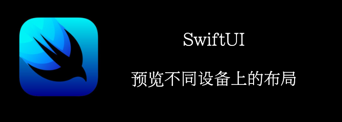

SwiftUI允许我们通过.previewDevice()修饰符，在多种屏幕尺寸上、设备类型同时预览布局。
<!--truncate-->
## Getting ready

首先创建一个新项目：**PreviewOnDifferentDevices**

## How to do it

1. 添加一张图片到Preivew Content的xcassets中。
2. 替换默认的Text为以下代码
```swift
struct ContentView: View {
    var body: some View {
          VStack{
            Image("friendship")
               .resizable()
               .aspectRatio(contentMode: .fit)
            Text("Importance of  Friendship").font(.title)
            Text("Friends helps us deal with stress and make better life choices")
                .multilineTextAlignment(.center).padding()
          }
    }
}
```

3. 修改preview的代码，在对个设备上同时预览
```swift
struct ContentView_Previews: PreviewProvider {
    static var previews: some View {
        Group {
            ContentView()
                .previewDevice(.init(rawValue: "iPhone 11 Pro Max"))
                .previewDisplayName("Iphone 11 Pro Max")
            ContentView()
                .previewDevice(.init(rawValue: "iPhone 8"))
                .previewDisplayName("iPhone 8")
            ContentView()
                .previewLayout(.fixed(width: 568, height: 320))
                .previewDisplayName("Custom Size landscape")
            
        }
    }
}
```

最终结果


## How it works

 **.previewDevice()**修饰符能够让你在特定设备上预览。

如果你不知道名字的话，可以通过模拟器来确定


如果要看横屏的话，可以通过自定义大小来查看:**.previewLayout()**

