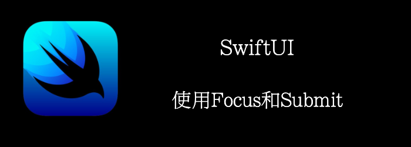

如果用户必须手动单击每个字段，填写它，然后单击填写下一个，这可能会很乏味。一个更容易和更快的方法是使用键盘上的按钮从一个表单字段跳转到下一个。

本章，我们将创建一个地址表单，在各个字段之间轻松跳转。
<!--truncate-->
## Getting ready

创建一个新的SwiftUI项目：**FocusAndSubmit**

## How to do it…

1. 在ContentView中定义一个输入框类型枚举
```swift
struct ContentView: View {
    enum AddressField{
        case streetName
        case city
        case state
        case zipCode
    }
    var body: some View {
        Text("hello world")
    }
}
```

2. 添加一些State，准备和TextField绑定
```swift
@State private var streetName = ""
@State private var city = ""
@State private var state = ""
@State private var zipCode = ""
```

3. 添加一个**@FocusState**，控制那个输入框正在输入
```swift
@FocusState private var currentFocus: AddressField?
```

4. 构建UI
```swift
var body: some View {
    VStack {
        TextField("Address", text: $streetName)
            .focused($currentFocus, equals:.streetName)
            .submitLabel(.next)
        TextField("City", text: $city)
            .focused($currentFocus, equals: .city)
            .submitLabel(.next)
        TextField("State", text: $state)
            .focused($currentFocus, equals:.state)
            .submitLabel(.next)
        TextField("Zip code", text: $zipCode)
            .focused($currentFocus, equals:.zipCode)
            .submitLabel(.done)
    }
}
```

5. 添加**.onSubmit**到VStack, 在里面修改currentFocus，控制哪个输入框Foucus。
```swift
.onSubmit {
   switch currentFocus {
    case .streetName: currentFocus = .city
    case .city: currentFocus = .state
    case .state:currentFocus = .zipCode
    default:
        print("Thanks for providing your address")
    }
}
```


当点击next时，下一个输入框会聚焦

## How it works…

**@FocusState**定义了Foucus的状态变化。

使用**.focused(_ : equals:)**将View和FoucusState绑定。当聚焦状态改变时，会更新FoucusState，更新FoucusState也会改变对应View的聚焦状态。

我们使用**.submitLabel()**来控制键盘右下角的submit按钮。当点击按钮时，会触发.onSubmit注册的回调。
