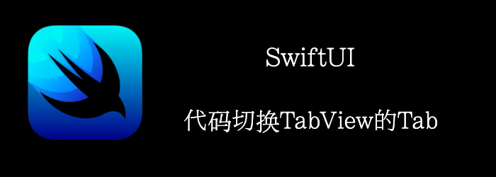

在上一篇文章中，我们介绍了如何点击底部tab，跳转不同界面。然而，我们有时候也想通过代码触发跳转。

本章，我们将使用一个tap gesture来从一个tab跳转到另一个tab。
<!--truncate-->
## Getting ready

首先创建一个新的SwiftUI项目：**TabViewWithGestures**

## How to do it…

1. 添加一个State记录当前选中的tab
```swift
@State private var tabSelected = 0
```

2. 添加UI
```swift
var body: some View {
        TabView(selection: $tabSelected) {
            Text("Left Tab. Click to switch to right")
                .onTapGesture {
                    self.tabSelected = 1
                }.tabItem {
                    Label("Left", systemImage: "l.circle.fill")
                }.tag(0)
            Text("Right Tab. Click to switch to left")
                .onTapGesture {
                    self.tabSelected = 0
                }.tabItem {
                    Label("Right", systemImage: "l.circle.fill")
                }.tag(1)
        }
    }

```


## How it works…

要想代码切换tab，我们首先得创建一个存储当前选中tab的State。然后作为TabView的selection参数。

我们添加.tag()修饰符来指定每个tab。要切换是，为State赋值为对应的tag即可。本例中，我们在onTapGesture中修改了state为第二个tab的tag，因此会自动切换到第二个tab。
