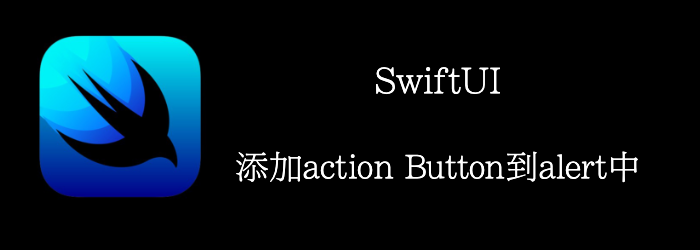

上个例子显示了Alert的基本用法。我们只显示了一个Ok。如果我们想要多个Btn呢？

本文将介绍如何添加action button到alert中。
<!--truncate-->
## Getting ready

新建一个SwiftUI项目：**AlertsWithActions**

## How to do it

1. 添加2个State
```swift
@State private var changeText = false
@State private var displayedText = "Tap to Change Text"
```

2. 添加一个按钮
```swift
Button(displayedText){
    changeText = true
}
```

3. 添加alert
```swift
var body: some View {
    Button(displayedText) {
        changeText = true
    }.alert("Changing Text", isPresented: $changeText) {
        Button("Yea"){
                displayedText = (displayedText == "Stay Foolish") ? "Stay Hungry" : "Stay Foolish"
        }
        Button("Do nothing"){}
    } message: {
        Text("Do you want to toggle the text?")
    }
}
```


## How it works

alert的actions闭包，可以在里面提供多个按钮，然后单独为每个按钮设置action。
