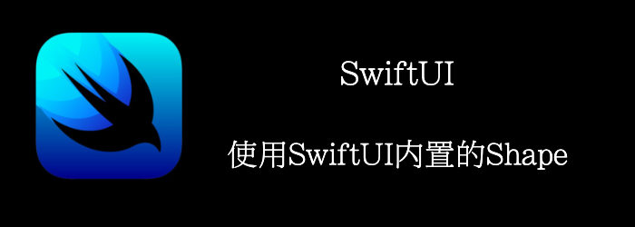

SwiftUI有5个内置的shape:

- Rectangle
- RoundedRectangle
- Capsule
- Circle
- Ellipse

我们也可以结合他们，创建更复杂的shape。
<!--truncate-->
## Getting ready

首先 ，我们新建一个SwiftUI工程**BuiltInShapes**

## How to do it…

1. 首先创建一个Vstack来显示我们的所有shape
```swift
var body: some View {
    VStack(spacing: 10){

    }.padding(.horizontal, 20)
}
```

2. 添加shape
```swift
var body: some View {
  VStack(spacing: 10){
      Rectangle().stroke(.orange, lineWidth: 15)
      RoundedRectangle(cornerRadius: 20).fill(.red)
      Capsule(style: .continuous).fill(.green).frame(height: 100)
      Capsule(style: .circular).fill(.green).frame(height: 100)
      Circle().stroke(.blue, lineWidth: 15)
      Ellipse().fill(.purple)
  }.padding(.horizontal, 20)
}
```


## How it works…

代码比较简单，我们解释下capsule

capsule有两种圆角

- Continuous： 圆角是平滑过渡到横线的
- Circular：不是平滑过渡，就是半圆

然后再注意下stroke和stokeBorder的区别

Stroke: frame是stroke的中线


strokeBorder：在frame内部创建一个stroke，stroke的外边沿是frame。


