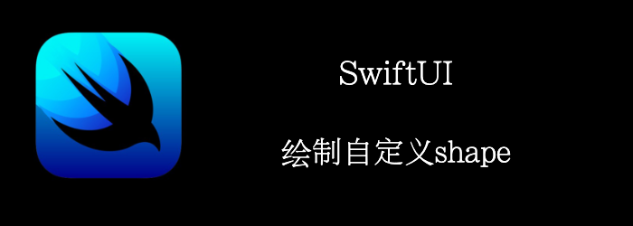

自定义shape也只是使用Path组件定义好形状，然后包裹成一个Shape就行了。

本章，我们将自定义一个菱形。
<!--truncate-->
## Getting ready

首先，创建一个SwiftUI工程：**RhombusApp**

## How to do it…

1. 创建菱形
```swift
struct Rhombus: Shape {
    func path(in rect: CGRect) -> Path {
        Path() { path in
            path.move(to: CGPoint(x: rect.midX, y: rect.minY))
            path.addLine(to: CGPoint(x: rect.minX, y: rect.midY))
            path.addLine(to: CGPoint(x: rect.midX, y: rect.maxY))
            path.addLine(to: CGPoint(x: rect.maxX, y: rect.midY))
            path.closeSubpath()
        }
    }
}
```

2. 显示出来
```swift
var body: some View {
    Rhombus()
        .fill(.orange)
        .aspectRatio(0.7, contentMode: .fit)
        .padding(.horizontal, 10)
}
```


## How it works…

要创建自定义shape，你需要实现Shape协议

Shape协议需要实现`func path(in rect: CGRect) -> Path `。

我们创建一个Path，在path的闭包中绘制图形。

注意绘制的坐标系的原点在左上角：


## Shape的Api

### Defining a Shape’s Path

```swift
//上面演示过了，定义shape的path
func path(in rect: CGRect) -> Path
//根据按百分比，截断path
func trim(from startFraction: CGFloat = 0, to endFraction: CGFloat = 1) -> some Shape
```

我们来看看trim的demo

```swift
var body: some View {
  //只要path的0-25%,所以得到的圆弧是1/4，在闭合path
    Circle().trim(from: 0, to: 0.25)
}
```


### Transforming a Shape

```swift
func transform(_ transform: CGAffineTransform) -> TransformedShape<Self>
func size(_ size: CGSize) -> some Shape
func scale(_ scale: CGFloat, anchor: UnitPoint = .center) -> ScaledShape<Self>
func rotation(_ angle: Angle, anchor: UnitPoint = .center) -> RotatedShape<Self>
func offset(_ offset: CGSize) -> OffsetShape<Self>
```

### Setting the Stroke Characteristics

```swift
func stroke<S>(_ content: S, lineWidth: CGFloat = 1) -> some View where S : ShapeStyle
//StrokeStyle定义了linewidth，连接头的样式，虚线等
func stroke<S>(_ content: S, style: StrokeStyle) -> some View where S : ShapeStyle
