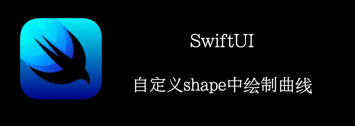

上一篇文章中，我们介绍了如何绘制自定义shape，但只使用了直线。

本文将介绍如何绘制曲线。

我们来绘制一个心形。
<!--truncate-->
## Getting ready

首先创建一个SwiftUI项目：**Heart**

## How to do it…

1. 首先，我们创建一个extension，来快速获取矩形的1/4的位置。
```swift
extension CGRect {
    var quarterX: CGFloat {
        minX + size.height/4
    }

    var quarterY: CGFloat {
        minY + size.height/4
    }

    var threeQuartersX: CGFloat {
        minX + 3*size.height/4
    }

    var threeQuartersY: CGFloat {
        minY + 3*size.height/4
    }
}
```

2. 创建心形
```swift
struct Heart: Shape {
    func path(in rect: CGRect) -> Path {
        Path() { path in
            path.move(to: CGPoint(x: rect.midX, y: rect.maxY))
            path.addCurve(to: CGPoint(x: rect.minX, y: rect.quarterY),
                          control1: CGPoint(x: rect.midX, y: rect.threeQuartersY),
                          control2: CGPoint(x: rect.minX, y: rect.midY))
            path.addArc(center: CGPoint(x: rect.quarterX, y: rect.quarterY),
                        radius: rect.size.width/4,
                        startAngle: .radians(.pi),
                        endAngle: .radians(0),
                        clockwise: false)
            path.addArc(center: CGPoint(x: rect.threeQuartersX, y: rect.quarterY),
                        radius: rect.size.width/4,
                        startAngle: .radians(.pi),
                        endAngle: .radians(0),
                        clockwise: false)
            path.addCurve(to: CGPoint(x: rect.midX, y: rect.maxY),
                          control1: CGPoint(x: rect.maxX, y: rect.midY),
                          control2: CGPoint(x: rect.midX, y: rect.threeQuartersY))
        }
    }
}
```

3. 显示
```swift
var body: some View {
    Heart()
        .fill(.red)
        .overlay(Heart().stroke(.orange, lineWidth: 10))
        .aspectRatio(contentMode: .fit)
        .padding(.horizontal, 20)
}
```


## How it works…

我们首先定位到底部中央，然后沿着顺时针绘制。

我们可以看到**arc()** 函数有个 **clockwise** 参数。但是我们的clockwise设置为false，方向却是顺时针，有点奇怪，这是为什么呢？

这是因为SwiftUI和UIView一样，也是使用一个flipped coordinate system。所以SwiftUI中的顺时针，对用户来说就是逆时针。所以我们设置为false。


