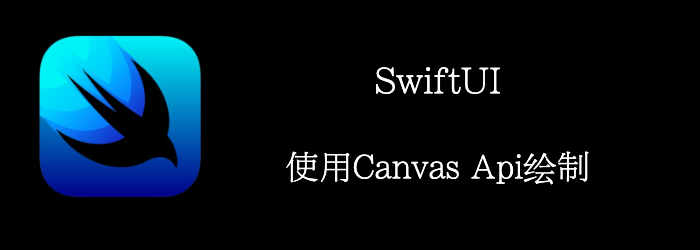

UIkit我们可以通过继承UIView，然后在drawRect中使用Core Graphic Api进行绘制。

SwiftUI通过**Canvas**实现这个功能，我们可以在Canvas中使用Core Graphic 进行绘制。

我们来实现一个绘图App。
<!--truncate-->
## Getting ready

首先，我们创建一个SwiftUI工程：**Drawing**

## How to do it…

1. 首先我们创建个Line数据结构, 并在ContentView中增加一个State
```swift
struct Line {
    var points: [CGPoint]
}
struct ContentView: View {
    @State var lines: [Line] = []
    var body: some View {
        
    }
}
```

2. 在body中，我们加入Canvas，能够将lines绘制出来
```swift
var body: some View {
  Canvas { ctx, size in
      for line in self.lines {
          var path = Path()
          path.addLines(line.points)
          ctx.stroke(path, with: .color(.red),style: .init(lineWidth: 5, lineCap: .round, lineJoin: .round))
      }
  }
}
```

3. 我们添加个手势，能够根据手势，更新lines
```swift
var body: some View {
        Canvas { ctx, size in
            for line in self.lines {
                var path = Path()
                path.addLines(line.points)
                ctx.stroke(path, with: .color(.red),style: .init(lineWidth: 5, lineCap: .round, lineJoin: .round))
            }
        }.gesture(DragGesture(minimumDistance: 0, coordinateSpace: .local).onChanged({ value in
            let position = value.location
            if value.translation == .zero {
                lines.append(Line(points: [position]))
            } else{
                guard let lastIdx = lines.indices.last else {
                    return
                }
                lines[lastIdx].points.append(position)
            }
        }))
    }
```


## How it works…

整个app主要分为2部分：

- 通过**points**数组进行绘制：Canvas提供了一个Context，我们能够在里面用CoreGraphic APi进行绘制，我们创建了一个Path，然后将Points传给path , 最后再stroken。
- 为每次手指的点移动都创建一个points数组保存。我们用了**DrawGesture**，并用onChange监听移动。如果**translation**为.zero，说明手指按下，因此我们需要添加一条新的Line到数组中。如果translation大于zero，说明手指在移动，此时我们需要更新line里面的points。
