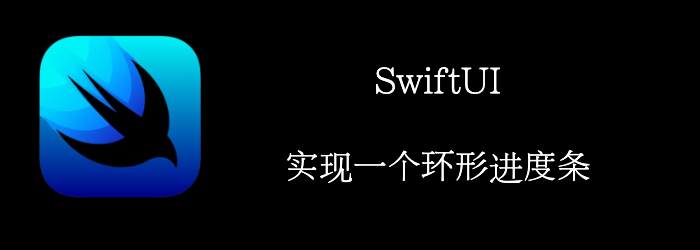

本文我们将实现一个类似于Apple Watch上的环形进度条，并用Slider控制进度。
<!--truncate-->
## Getting ready

首先，创建一个新的SwiftUI项目：**ProgressRings**

## How to do it…

1. 首先，我们顶一个一个环形的shape: ProgressRing
```swift
struct ProgressRing: Shape {
    private let startAngle = Angle.radians(1.5 * .pi)
    @Binding var progress: Double
    func path(in rect: CGRect) -> Path {
        Path() { path in
            path.addArc(center: CGPoint(x: rect.midX, y: rect.midY), radius: rect.width/2.0, startAngle: startAngle, endAngle: startAngle + Angle(radians: 2 * .pi * progress), clockwise: false)            
        }
    }
}
```

2. 创建一个ProgressRingsView，用来显示多个同心圆
```swift
struct ProgressRingsView: View {
    private let ringPadding = 5.0
    private let ringWidth = 40.0
    private var ringStrokeStyle: StrokeStyle {
        StrokeStyle(lineWidth: ringWidth, lineCap: .round, lineJoin: .round)
    }
    @Binding var progressExternal: Double
    @Binding var progressCentral: Double
    @Binding var progressInternal: Double
    var body: some View {
        ZStack {
            ProgressRing(progress: $progressInternal)
                .stroke(.blue, style: ringStrokeStyle)
                .padding(2*(ringWidth + ringPadding))
            ProgressRing(progress: $progressCentral)
                .stroke(.red, style: ringStrokeStyle)
                .padding(ringWidth + ringPadding)

            ProgressRing(progress: $progressExternal)
                .stroke(.green, style: ringStrokeStyle)
                .padding(ringWidth)
        }
    }
}
```

3. 在ContentView中创建最终的View，加上可调节进度的Slider
```swift
struct ContentView: View {
    @State private var progressExternal = 0.3
    @State private var progressCentral = 0.7
    @State private var progressInternal = 0.5

    var body: some View {
        ZStack {
            ProgressRingsView(progressExternal: $progressExternal, progressCentral: $progressCentral, progressInternal: $progressInternal)
                .aspectRatio(contentMode: .fit)

            VStack(spacing: 10) {
                Spacer()
                Slider(value: $progressInternal, in: 0 ... 1, step: 0.01)
                Slider(value: $progressCentral, in: 0 ... 1, step: 0.01)
                Slider(value: $progressExternal, in: 0 ... 1, step: 0.01)
            }.padding(30)
        }
    }
}
```

最终：


## How it works…

**ProgressRing**只是简单的Path+arc，他暴露了progress供外部设置进度。

之后，我们ProgressRingsView中添加了3个同心圆。分别暴露@Binding供外部设置

最终我们在ContentView中加上了Slider，并调节进度。

