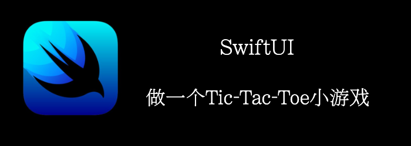

本章我们将用SwiftUI实现一个Tic-Tac-Toe小游戏。

如果不知道规则，可以网上搜索一下，简单来讲就是3子棋，3个连成线就获胜。
<!--truncate-->
## Getting ready

首先，我们新建一个项目：**TicTacToe**

## How to do it…

TicTacToe由三部分组成：

- 棋盘
- 圈圈
- 叉叉

1. 构建圈圈
```swift
struct Nought: View {
    var body: some View {
        Circle()
            .stroke(.red, lineWidth: 10)
    }
}
```

2. 构建叉叉
```swift
struct CrossShape: Shape {
    func path(in rect: CGRect) -> Path {
        Path() { path in
            path.move(to: CGPoint(x: rect.minX, y: rect.minY))
            path.addLine(to: CGPoint(x: rect.maxX, y: rect.maxY))
            path.move(to: CGPoint(x: rect.maxX, y: rect.minY))
            path.addLine(to: CGPoint(x: rect.minX, y: rect.maxY))
        }
    }
}
struct Cross: View {
    var body: some View {
        CrossShape()
            .stroke(.green, style: StrokeStyle(lineWidth: 10, lineCap: .round, lineJoin: .round))
    }
}
```

3. 定义Cell来抽象每一个格子
```swift
struct Cell: View {
    enum CellType {
        case hidden
        case nought
        case cross
    }
    @State private var type: CellType = .hidden
    @Binding var isNextNought: Bool
    @ViewBuilder private var content: some View {
        switch type {
        case .hidden: Color.clear
        case .nought: Nought()
        case .cross: Cross()
        }
    }
    var body: some View {
        content
            .padding(20)
            .contentShape(Rectangle())
            .onTapGesture {
                guard type == .hidden else {
                    return
                }
                type = isNextNought ? .nought : .cross
                isNextNought.toggle()
            }
    }
}
```

4. 实现棋盘
```swift
struct GridShape: Shape {
    func path(in rect: CGRect) -> Path {
        Path() { path in
            path.move(to: CGPoint(x: rect.width/3, y: rect.minY))
            path.addLine(to: CGPoint(x: rect.width/3, y: rect.maxY))
            path.move(to: CGPoint(x: 2*rect.width/3, y: rect.minY))
            path.addLine(to: CGPoint(x: 2*rect.width/3, y: rect.maxY))
            path.move(to: CGPoint(x: rect.minX, y: rect.height/3))
            path.addLine(to: CGPoint(x: rect.maxX, y: rect.height/3))
            path.move(to: CGPoint(x: rect.minX, y: 2*rect.height/3))
            path.addLine(to: CGPoint(x: rect.maxX, y: 2*rect.height/3))
        }
    }
}

struct Row: View {
    @Binding var isNextNought: Bool
    var body: some View {
        HStack {
            Cell(isNextNought: $isNextNought)
            Cell(isNextNought: $isNextNought)
            Cell(isNextNought: $isNextNought)
        }
    }
}
struct Grid: View {
    @State var isNextNought: Bool = false
    var body: some View {
        ZStack {
            GridShape().stroke(.blue, lineWidth: 15)
            VStack {
                Row(isNextNought: $isNextNought)
                Row(isNextNought: $isNextNought)
                Row(isNextNought: $isNextNought)
            }
        }.aspectRatio(contentMode: .fit)
    }
}
```

5. 在ContentView中使用
```swift
struct ContentView: View {
    var body: some View {
        Grid().padding(.horizontal, 20)
    }
}
```


## How it works…

**isNextNought**变量定义 下一个将放置哪种类型的标记。它在**Grid**组件中设置为**false**，这意味着第一个标记将始终是**Cross**。当点击一个单元格时，**isNextNought**变量将被切换。

有趣的是，在为**onTapGesture**手势应用视图修饰符之前，我们必须设置一个**contentShape()**修饰符。之所以会这样，是因为默认的可点击区域是由组件的可见部分给出的，但是一开始，所有的单元格都是隐藏的，所以该区域是空的！

然后**contentShape()**修饰符定义可以检测到触摸的命中测试区域。在这种情况下，我们希望它占据整个区域，因此使用**Rectangle**，但我们可以使用**Circle**、**Capsule**，甚至自定义形状。

不过这个游戏还没有完全完成，还缺少判断赢的逻辑，感兴趣的可以自己补全。
