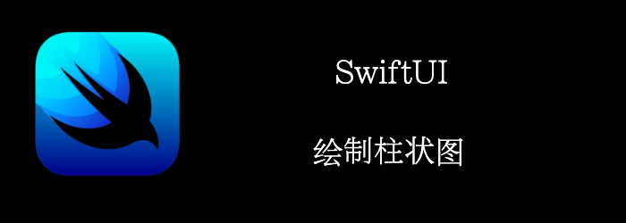

使用简单的形状，可以构建一些不错的功能。例如，只需使用一堆矩形，我们就可以创建一个柱状图。

本文，我们将创建一个条形图显示了三个欧洲城市的平均月降水量：都柏林、米兰和伦敦。
<!--truncate-->
## Getting ready

首先，创建一个新的项目：**BarChart**。

## How to do it…

1. 定义数据model
```swift
enum Month: String, CaseIterable {
    case jan, feb, mar, apr, may, jun, jul, aug, sep, oct, nov, dec
}

struct MonthDataPoint: Identifiable {
    var id: String { month.rawValue }
    let month: Month
    let value: Double
    var name: String {
        month.rawValue.capitalized
    }
}
extension Array where Element == Double {
    func monthDataPoints() -> [MonthDataPoint] {
        zip(Month.allCases, self)
            .map(MonthDataPoint.init)
    }
}

```

2. 准备数据
```swift
struct DataSet {
    static let dublin = [ 0.65, 0.50, 0.55, 0.55, 0.60, 0.65, 0.55, 0.75, 0.60, 0.80, 0.75, 0.75].monthDataPoints()
    static let milan = [0.65, 0.65, 0.80, 0.80, 0.95, 0.65,0.70, 0.95, 0.70, 1.00, 1.00, 0.60].monthDataPoints()
    static let london = [ 0.55, 0.40, 0.40, 0.45, 0.50, 0.45,0.45, 0.50, 0.50, 0.70, 0.60, 0.55,].monthDataPoints()
}
```

3. 定义我们的柱状图
```swift
struct BarView: View {
    var dataPoint: MonthDataPoint
    var body: some View {
        VStack {
            ZStack (alignment: .bottom) {
                Rectangle()
                    .fill(.blue)
                    .frame(width: 18, height: 180)
                Rectangle()
                    .fill(.white)
                    .frame(width: 18, height: dataPoint.value * 180.0)
            }
            Text(dataPoint.name)
                .font(.system(size: 11))
                .rotationEffect(.degrees(-45))
        }
    }
}

struct BarChartView: View {
    var dataPoints: [MonthDataPoint]
    var body: some View {
        HStack (spacing: 12) {
            ForEach(dataPoints) {
                BarView(dataPoint: $0)
            }
        }
    }
}
```

4. 用Picker将3个城市的数据显示出来
```swift
struct ContentView: View {
    let dataSet = [
        DataSet.dublin,
        DataSet.milan,
        DataSet.london,
    ]
    @State var selectedCity = 0
    var body: some View {
        VStack(spacing: 24) {
            Spacer()
            Text("Average Precipitation")
                .font(.system(size: 32))
            Picker(selection: self.$selectedCity, label: Text("Average Precipitation")) {
                Text("Dublin").tag(0)
                Text("Milan").tag(1)
                Text("London").tag(2)
            }.pickerStyle(SegmentedPickerStyle())
            BarChartView(dataPoints: dataSet[selectedCity])
            Spacer()
        }
        .padding(.horizontal, 10)
        .background( .mint, ignoresSafeAreaEdges: .vertical)
    }
}
```


## How it works…

我们用一个ZStack和2个Rectangle做成了一个柱状图，一个空矩形 用于背景和一个矩形显示百分比。再将多个柱状图组合起来形成图表。
