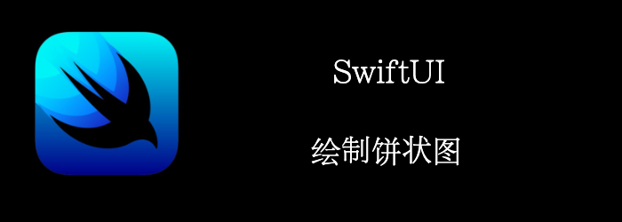

我们知道饼图是一种通过使用形成圆圈的切片来表示比例数值的方法。饼图由一个切片和一个圆组成, 在 SwiftUI 中实现它们非常简单。

本章将显示用饼状图显示三个不同欧洲城市的宠物数量。
<!--truncate-->
## Getting ready

首先，创建一个新的SwiftUI项目：**PieChart**

## How to do it…

1. 首先，定义数据结构
```swift
enum Animal: String {
   case cat
   case dog
   case fish
   case horse
   case hamster
   case rabbit
   case bird
   var color: Color {
       switch self {
       case .cat: return .red
       case .dog: return .blue
       case .fish: return .green
       case .horse: return .orange
       case .hamster: return .purple
       case .rabbit: return .gray
       case .bird: return .yellow
       }
   }
}

struct PetData {
    let value: Double
    let animal: Animal
    var color: Color {
        animal.color
    }
    var name: String {
        animal.rawValue.capitalized
    }
}

struct DataPoint: Identifiable {
    let id = UUID()
    let label: String
    let value: Double
    let color: Color
    var percentage = 0.0
    var startAngle = 0.0
    var formattedPercentage: String {
        String(format: "%.2f %%", percentage * 100)
    }
}

struct DataPoints {
    var points = [DataPoint]()
    mutating func add(value: Double, label: String, color: Color) {
        points.append(DataPoint(label: label, value: value, color: color))
        let total = points.map(\.value).reduce(0.0,+)
        points = points.map {
            var point = $0
            point.percentage = $0.value / total
            return point
        }

        for i in 1..<points.count {
            let previous =  points[i - 1]
            let angle = previous.startAngle + previous.value*360/total
            var current = points[i]
            current.startAngle = angle
            points[i] = current
        }
    }
}
```

2. 准备数据
```swift
struct DataSet {
    static let dublin: [PetData] = [
        .init(value: 2344553, animal: .cat),
        .init(value: 1934345, animal: .dog),
        .init(value: 323454, animal: .fish),
        .init(value: 403400, animal: .rabbit),
        .init(value: 1003445, animal: .horse),
        .init(value: 1600494, animal: .hamster),
    ]

    static let milan: [PetData] = [
        .init(value: 3344553, animal: .cat),
        .init(value: 2004345, animal: .dog),
        .init(value: 923454, animal: .fish),
        .init(value: 803400, animal: .rabbit),
        .init(value: 1642345, animal: .bird),
        .init(value: 804244, animal: .hamster),
    ]

    static let london: [PetData] = [
        .init(value: 3355553, animal: .cat),
        .init(value: 4235345, animal: .dog),
        .init(value: 1913454, animal: .fish),
        .init(value: 1103400, animal: .rabbit),
        .init(value: 683445, animal: .horse),
        .init(value: 3300494, animal: .hamster),
    ]
}
```

3. 定义饼的形状
```swift
struct PieSliceShape: InsettableShape {
    var percent: Double
    var startAngle: Angle
    var insetAmount: CGFloat = 0

    func inset(by amount: CGFloat) -> some InsettableShape {
        var slice = self
        slice.insetAmount += amount
        return slice
    }

    func path(in rect: CGRect) -> Path {
        Path { path in
            path.addArc(center: CGPoint(x: rect.size.width / 2, y: rect.size.width / 2), radius: rect.size.width / 2 - insetAmount, startAngle: startAngle, endAngle: startAngle + Angle(degrees: percent * 360), clockwise: false)
        }
    }
}

struct PieSlice: View {
    var percent: Double
    var degrees: Double
    var color: Color

    var body: some View {
        GeometryReader { geometry in
            PieSliceShape(percent: percent, startAngle: Angle(degrees: degrees))
                .strokeBorder(color, lineWidth:geometry.size.width/2)
                .rotationEffect(.degrees(-90))
               .aspectRatio(contentMode: .fit)
        }
    }
}
```

4. 定义整个饼图
```swift
struct PieChart: View {
    var dataPoints: DataPoints
    var body: some View {
        VStack(alignment: .leading, spacing: 30) {
            VStack(alignment: .leading) {
                ForEach(dataPoints.points) { p in
                    HStack(spacing: 16) {
                        Rectangle()
                       .foregroundColor(p.color)
                       .frame(width: 16, height: 16)
                        Text("\(p.label): \(p.formattedPercentage)")
                    }
                }
            }
            ZStack {
                ForEach(dataPoints.points) { point in
                  PieSlice(percent: point.percentage, degrees: point.startAngle, color: point.color)
                }
            }.aspectRatio(contentMode: .fill)
        }
    }
}
```

5. 显示数据
```swift
struct ContentView: View {
    var dataSet: [DataPoints] = [
        DataSet.dublin.reduce(into: DataPoints()) {
          $0.add(value: $1.value, label: $1.name, color: $1.color)
        },
        DataSet.milan.reduce(into: DataPoints()) {
            $0.add(value: $1.value, label: $1.name, color: $1.color)
        },
        DataSet.london.reduce(into: DataPoints()) {
            $0.add(value: $1.value, label: $1.name, color: $1.color)
        },
    ]

    @State var selectedCity = 0
    var body: some View {
        VStack (spacing: 50) {
            Text("Most Popular Pets")
                .font(.system(size: 32))

            Picker(selection: self.$selectedCity, label: Text("Most Popular Pets")) {
                Text("Dublin").tag(0)
                Text("Milan").tag(1)
                Text("London").tag(2)
            }.pickerStyle(SegmentedPickerStyle())
            PieChart(dataPoints: dataSet[selectedCity])
                .aspectRatio(1, contentMode: .fit)
            Spacer()
        }
        .padding(.horizontal, 20)
    }
}
```


## How it works

我们使用了**InsettableShape**， 这允许我们使用**strokeBorder()**而不是**stroke()**。之前我们已经介绍过他们的区别了：


有了strokeBorder()，我们只要让border等于圆的半径，那么就能看到一块圆饼。

为了拿到圆的半径，我们使用了GeometryReader，能够通过geometry.size拿到大小。

使用rotationEffect，将绘制开始的位置变为中间，这样每个圆饼的中间都会是分割线。
