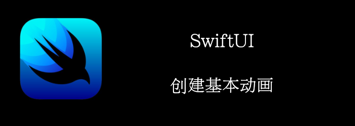

我们来实现，将2个圆圈从顶部移动到底部。
<!--truncate-->
## Getting ready

首先，创建一个新的SwiftUI工程：**BasicAnimations**

## How to do it…

1. 首先，我们定义一个包含默认时间曲线的类型，供我们List选择
```swift
struct AnimationType {
    let name: String
    let animation: Animation
    static var all: [AnimationType]  = [
      .init(name: "default", animation: .default),
      .init(name: "easeIn", animation: .easeIn),
      .init(name: "easeOut", animation: .easeOut),
      .init(name: "easeInOut", animation: .easeInOut),
      .init(name: "linear", animation: .linear),
      .init(name: "spring", animation: .spring()),
    ]
}
```

2. 然后在ContentView中添加几个状态，供我们使用
```swift
struct ContentView: View {
    @State var onTop = false //是否在顶部，控制是从上到下，还是从下到上
    @State var showSelection = false //是否显示动画选择界面
  //当前选择的动画类型
    @State var type = AnimationType(name: "default", animation: .default)

    var body: some View {
        Text("")
    }
}
```

3. 添加两个圆圈
```swift
var body: some View {
    VStack(spacing: 12) {
        GeometryReader { geometry in
            HStack {
                Circle()
                    .fill(.blue)
                    .frame(width: 80, height: 80)
                    .offset(y: onTop ? -geometry.size.height/2 : geometry.size.height/2)
                    .animation(.default, value: onTop)
                Spacer()
                Circle()
                    .fill(.red)
                    .frame(width: 80, height: 80)
                    .offset(y: onTop ? -geometry.size.height/2 : geometry.size.height/2)
                    .animation(type.animation, value: onTop)
            }.padding(.horizontal, 30)
        }
    }
}
```

4. 添加个actionsheet，让我们选择动画类型
```swift
var actionSheet: ActionSheet {
    ActionSheet(title: Text("Animations"),
                message: nil,
                buttons: AnimationType.all.map{ type in
            .default(Text(type.name)) {
                self.type = type
            }
    } + [.destructive(Text("Cancel"))])
}   
```

5. 在VStack中添加2个按钮，来触发动画，和选择动画类型
```swift
Button("Animate") {
    onTop.toggle()
}
Button("Choose Animation") {
    showSelection.toggle()
}.actionSheet(isPresented: $showSelection) {
    actionSheet
}
Text("Current: \(type.name)")
```


## How it works…

我们可以看到做动画有3步：

- 某个触发动画的事件，比如我们的按钮点击
- 某个状态，我们根据这个状态修改数据，比如onTop
- UI状态的改变，比如我们的offset(y:)

有了这3点，我们添加一个 **.animation()**修饰符，SwiftUI就会在触发时完成动画。

如果你希望动画慢一点，好看清不同动画的区别，那么你可以设置speed

```swift
.animation(Animation.default.speed(0.1), value: onTop)
```

## Animation的Api

### Instance Methods

```swift
func delay(_ delay: Double) -> Animation//延迟
func repeatCount(_ repeatCount: Int, autoreverses: Bool = true) -> Animation//重复
func repeatForever(autoreverses: Bool = true) -> Animation
func speed(_ speed: Double) -> Animation
```

### Type Methods

```swift
//我们熟悉的时间曲线，动画时间是一个参数，并不是单独的修饰符
static func easeIn(duration: Double) -> Animation
static func easeInOut(duration: Double) -> Animation
static func easeOut(duration: Double) -> Animation
static func interactiveSpring(response: Double = 0.15, dampingFraction: Double = 0.86, blendDuration: Double = 0.25) -> Animation
static func interpolatingSpring(mass: Double = 1.0, stiffness: Double, damping: Double, initialVelocity: Double = 0.0) -> Animation
static func linear(duration: Double) -> Animation
static func spring(response: Double = 0.55, dampingFraction: Double = 0.825, blendDuration: Double = 0) -> Animation
static func timingCurve(_ c0x: Double, _ c0y: Double, _ c1x: Double, _ c1y: Double, duration: Double = 0.35) -> Animation
