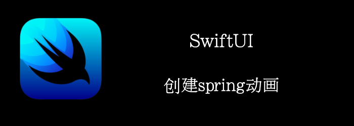

我们将演示如何让一个banner做spring动画。
<!--truncate-->
## Getting ready

首先，创建一个新的项目：**BannerWithASpringAnimation**

## How to do it…

1. 实现我们的banner
```swift
struct BannerView: View {
    let message: String
    var show: Bool
    
    var body: some View {
        Text(message)
            .font(.title)
            .frame(width:UIScreen.main.bounds.width - 20, height: 100)
            .foregroundColor(.white)
            .background(Color.green)
            .cornerRadius(10)
            .offset(y: show ? -UIScreen.main.bounds.height / 3 : -UIScreen.main.bounds.height)
            .animation(.interpolatingSpring(mass: 2.0,  stiffness: 100.0, damping: 10, initialVelocity: 0), value: show)
    }
}
```

2. 添加Banner和一个按钮到ContentView中
```swift
struct ContentView: View {
    @State var show = false
    
    var body: some View {
        VStack {
            BannerView(message: "Hello world", show: show)
            Button {
                show.toggle()
            } label: {
                Text(show ? "Hide" : "Show")
                    .padding()
                    .frame(width: 100)
                    .foregroundColor(.white)
                    .background(show ? .red : .blue)
                    .cornerRadius(10)
            }
        }
    }
}
```

最终结果:


我们再复习一下动画的3个要素：

- 触发器：我们的按钮
- 数据变化：show
- UI变化：offset(y:)

我们再来看看spring动画的一些参数：

- **mass**：这是附着在弹簧上的物体的质量——它越大，它获得的惯性越大，所以它反弹得更多。
- **stiffness**：这是施加力时弹簧的抵抗力——阻力越大，弹簧的刚度越大。
- **damping**：这是弹簧抵抗变化的程度——阻力越大，弹簧的弹跳越小。
- **initialVelocity**：这是动画开始的初始速度。
