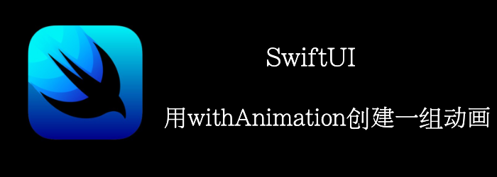

创建动画有2中方式：

- 使用 **.animation()** 修饰符
- 使用 **withAnimation** 函数

上一章，我们介绍了用animation修饰符创建一组动画，本章我们将介绍用withAnimation函数结合delay创建一组动画。
<!--truncate-->
## Getting ready

首先新建一个项目：**DelayedAnimations**

## How to do it…

1. 首先定义个extention，方便我们处理样式
```swift
struct CustomText: ViewModifier {
    let foreground: Color
    let background: Color
    let cornerRadius: Double

    func body(content: Content) -> some View {
        content
            .foregroundColor(foreground)
            .frame(width: 200)
            .padding()
            .background(background)
            .cornerRadius(cornerRadius)
    }
}

extension Text {
    func styled(color: Color) -> some View {
            modifier(CustomText(foreground: .white,
                                background: color,
                                cornerRadius: 10))    
        }
}
```

2. 添加3个Text
```swift
struct ContentView: View {
    @State var hideFirst = true
    @State var hideSecond = true
    @State var hideThird = true
    
    var body: some View {
        VStack {
            VStack {
                Text("First").styled(color: .red).opacity(hideFirst ? 0 : 1)
                Text("Second").styled(color: .red).opacity(hideSecond ? 0 : 1)
                Text("Third").styled(color: .red).opacity(hideThird ? 0 : 1)
            }
        }
    }
}
```

3. 在第一个Vstack中加个Spacer和一个Button来触发动画
```swift
Spacer()
Button {
    withAnimation(.easeInOut) {
        hideFirst.toggle()
    }
    withAnimation(.easeInOut.delay(0.3)) {
        hideSecond.toggle()
    }
    withAnimation(.easeInOut.delay(0.6)) {
        hideThird.toggle()
    }
} label: {
    Text("Animate").fontWeight(.heavy).styled(color: .green)
}
```

点击animate，我们能够看到3个按钮依次出现，再点一次依次消失


## How it works…

这个原理和animate修饰符一样，都是通过delay来实现一组动画。我们还是期待官方提供更合适的方法来实现一组动画。