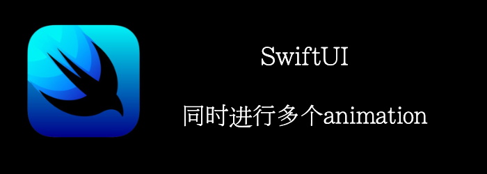

SwiftUI 允许 我们可以同时为多个属性设置动画，也可以使用不同的持续时间和不同的动画曲线对它们进行动画处理。

本章，我们将学习如何为两组特征设置动画，以及如何使结果看起来像一个单一的、平滑的动画。
<!--truncate-->
## Getting ready

首先，新建一个项目：**MultipleAnimations**

## How to do it…

1. 创建个rectangle，根据State改变多个属性
```swift
struct ContentView: View {
    @State var initialState = true
    var body: some View {
        VStack(spacing: 30) {
            Rectangle()
                .fill(initialState ? .blue : .red)
                .cornerRadius(initialState ? 50 : 0)
                .offset(y: initialState ? 0 : -200)
                .rotation3DEffect(initialState ? .degrees(0): .degrees(45), axis: (x: 1, y: 0, z: 0))
                .animation(.easeInOut(duration: 2), value: initialState)
               .frame(width:300, height:200)
        }
    }
}
```

2. VStack中添加个按钮触发动画
```swift
Button {
    initialState.toggle()
} label: {
    Text("Animate")
        .fontWeight(.heavy)
        .foregroundColor(.white)
        .padding()
        .background(.green)
        .cornerRadius(5)
}
```

3. 尝试在添加2中变化
```swift
Rectangle()
.fill(initialState ? .blue : .red)
.cornerRadius(initialState ? 50 : 0)
.offset(y: initialState ? 0 : -200)
.rotation3DEffect(initialState ? .degrees(0): .degrees(45), axis: (x: 1, y: 0, z: 0))
.scaleEffect(initialState ? 1 : 0.8)
.rotationEffect(initialState ? Angle(degrees:0) : Angle(degrees:-90))
.animation(.linear(duration: 1), value: initialState)
.frame(width: 300, height: 200)
```


## How it works…

animation是对之前的所有修饰符，所以我们在animate修饰符前直接修改对应的属性就行。