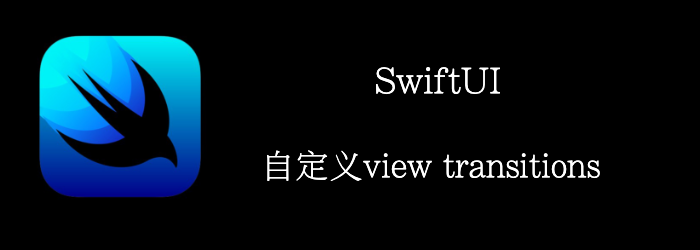

SwiftUI能够在view出现和消失时添加动画，我们称这个未transition。

本章，我们将演示如何创建自定义的出现和消失的transitions。
<!--truncate-->
## Getting ready

首先，创建一个新的项目**CustomViewTransition**

## How to do it…

1. 创建2个view
```swift
extension Image {
    func custom() -> some View {
        self
        .resizable()
        .aspectRatio(contentMode: .fit)
        .cornerRadius(20)
        .shadow(radius: 10)
    }
}

struct FirstComponent: View {
    var body: some View {
        Image(systemName: "gamecontroller").custom()
    }
}

struct SecondComponent: View {
    var body: some View {
        Image(systemName: "car").custom()
    }
}
```

2. 添加到ContentView中, 这个时候点击change，是一个渐变的消失和显示的过程
```swift
struct ContentView: View {
    @State var showFirst = true
    var body: some View {
        VStack(spacing: 24){
            if showFirst {
                FirstComponent()
            } else{
                SecondComponent()
            }
            Button {
                showFirst.toggle()
            } label: {
                Text("Change")
            }
        }.animation(.easeIn, value: showFirst)
            .padding(.horizontal, 20)
    }
}
```

3. 让我们创建一个transition，并设置两个component的transiton为这个自定义的transition
```swift
extension AnyTransition {
    static var moveScaleAndFade: AnyTransition {
        let insertion = AnyTransition
            .scale
            .combined(with: .move(edge: .leading))
            .combined(with: .opacity)
        let removal = AnyTransition
            .scale
            .combined(with: .move(edge: .top))
            .combined(with: .opacity)
        return .asymmetric(insertion: insertion, removal: removal)
    }
}

...
if showFirst {
    FirstComponent().transition(.moveScaleAndFade)
} else{
    SecondComponent().transition(.moveScaleAndFade)
}
....
```

点击change, appear的图片从左侧逐渐放大移入，disappear的从上面逐渐缩小移除。


## How it works…

transition基本上就是在appear和disappear时应用的一系列transformations。

我们使用**.combined**函数，可以将transition与其他transition组合以创建更复杂的动画。

我们使用了**.asymmetric** transition。这意味着删除看起来与插入不同。但当然，我们也可以有一个对称的transition。
