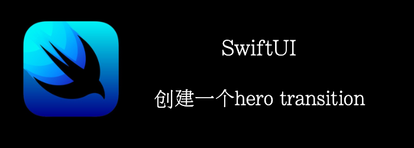

什么是hero transition？还记得我们的商品列表有个图片，点击图片，然后图片慢慢变大，成为新界面顶部的header，我们称这种为hero transition。比如：appstroe中就很常见。
<!--truncate-->
## Getting ready

首先，新建一个项目：**HeroViewTransition**

准备7张图片，加入项目中。

## How to do it…

1. 首先创建一个Item来代表列表中的数据
```swift
struct Item: Identifiable {
    let id = UUID()
    let image : String
    let title : String
    let details : String
}
```

2. 准备列表的数据
```swift
let data = [
    Item(image: "california", title: "California", details: "California, the most populous state in the United States and the third most extensive by area, is located on the western coast of the USA and is bordered by Oregon to the north, Nevada, to the east and northeast, Arizona to the southeast and it shares an international border with the Mexican state of Baja California to the south."),
    Item(image: "miami", title: "Miami", details: "Miami is an international city at Florida’s south-eastern tip. Its Cuban influence is reflected in the cafes and cigar shops that line Calle Ocho in Little Havana. On barrier islands across the turquoise waters of Biscayne Bay is Miami Beach, home to South Beach. This glamorous neighbourhood is famed for its colourful art deco buildings, white sand, surfside hotels and trendsetting nightclubs."),
    Item(image: "las-vegas", title: "Las Vegas", details: "Las Vegas, is a resort city famed for its vibrant nightlife, centered around 24-hour casinos and other entertainment options. Its main street and focal point is the Strip, just over 4 miles long.Nevada is a western U.S. state defined by its great expanses of desert, and by the 24-hour casinos and entertainment for which its largest city, Las Vegas, in Nevada’s Mojave Desert."),
    Item(image: "paris", title: "Paris", details: "Paris is the capital and most-populous city of France. Situated on the Seine River, in the north of the country, it is in the centre of the Île-de-France region, also known as the région parisienne. Paris has an area of 105.4 square kilometres and with a population of 2,273,305 people within its city limits is the most populous urban area in the European Union."),
    Item(image: "dublin", title: "Dublin", details: "Dublin, capital of the Republic of Ireland, is on Ireland’s east coast at the mouth of the River Liffey. Its medieval buildings include 13th-century Dublin Castle and imposing St. Patrick’s Cathedral, founded in 1191. Temple Bar is a riverside nightlife and cultural quarter, home to the Irish Film Institute. Bustling, largely pedestrianised Grafton Street is the city’s principal shopping area, also famed for its buskers."),
    Item(image: "bali", title: "Bali", details: "Bali “the world’s best island resort” with its enchanting culture, beaches, dynamic dances and music, with grand mountain views, green rainforests to trek through, rolling waves to surf and deep blue pristine seas to dive in where one can swim with dugongs, dolphins and large mantarays. Covering less than 6,000 square kilometers, this lush isle has startling geographical contrasts; verdant rice terraces and sacred, mist-wreathed volcanoes, white-sand beaches and dense tropical rain forest. as well as being home to one of the world’s most vibrant cultures of  dance and music, lavish ceremonies and artistic achievements."),
    Item(image: "singapore", title: "Singapore", details: "Singapore, an island city-state off southern Malaysia, is a bustling cosmopolitan city that offers a world-class living environment, with a landscape populated by high-rise buildings and gardens, and is a great place to visit for a couple of days if you are travelling to Asia. In circa-1820 Chinatown stands the red-and-gold Buddha’s Tooth Relic Temple, Little India offers colourful souvenirs and Arab Street is lined with fabric shops. Singapore is also known for eclectic street fare, served in hawker centres such as Tiong Bahru and Maxwell Road."),
]
```

3. 准备我们的列表，和跳转后的详情界面
```swift
struct DestinationListView: View {
    @Binding var selectedItem: Item!
    @Binding var showDetail: Bool
    let animation: Namespace.ID
    var body: some View {
        ScrollView(.vertical) {
            VStack(spacing: 20) {
                ForEach(data) { item in
                    Image(item.image)
                        .resizable()
                        .aspectRatio(contentMode: .fill)
                        .cornerRadius(10)
                        .shadow(radius: 5)
                        .matchedGeometryEffect(id: item.image, in: animation)
                        .onTapGesture {
                            selectedItem = item
                            withAnimation {
                                showDetail.toggle()
                            }
                        }
                }
            }.padding(.all, 20)
        }
    }
}

struct DestinationDetailView: View {
    var selectedItem: Item
    @Binding var showDetail: Bool
    let animation: Namespace.ID
    var body: some View {
        ZStack(alignment: .topTrailing){
            VStack{
                Image(selectedItem.image)
                    .resizable()
                    .aspectRatio(contentMode: .fit)
                    .matchedGeometryEffect(id: selectedItem.image, in: animation)
                Text(selectedItem.title)
                    .font(.title)
                Text(selectedItem.details)
                    .font(.callout)
                    .padding(.horizontal)
                Spacer()
            }.ignoresSafeArea(.all)
            Button {
                withAnimation {
                    showDetail.toggle()
                }
            } label: {
                Image(systemName: "xmark")
                    .foregroundColor(.white)
                    .padding()
                    .background(.black.opacity(0.8))
                    .clipShape(Circle())
            }.background(Color.white.ignoresSafeArea(.all))
    }
}
```

3. 在ContentView中添加List
```swift
struct ContentView: View {
    @State private var selectedItem: Item!
    @State private var showDetail = false
    @Namespace var animation
    var body: some View {
        ZStack {
            DestinationListView(selectedItem: $selectedItem, showDetail: $showDetail, animation: animation)
                .opacity(showDetail ? 0 : 1)
            if showDetail {
                DestinationDetailView(selectedItem: selectedItem, showDetail: $showDetail, animation: animation)
            }
        }
    }
}
```


## How it works…

您可以在**.matchedGeometryEffect**里设置开始组件和结束组件，然后 SwiftUI 会神奇地为您创建动画。

**.matchedGeometryEffect**会设置开始组件和结束组件间的关系，然后SwiftUI可以根据关系创建从开始位置到结束位置的动画。为了存储这种关系，**.matchedGeometryEffect**需要一个标识符和一个保存关系的地方。在我们的代码中，这是在以下行中完成的：

```swift
//我们以image为标识符，存储在animation中。
.matchedGeometryEffect(id: item.image, in: animation)
```

SwiftUI提供了一个property warpper:**@Namespace**。他会将view动画相关的一些属性存储在全局的某个地方，SwiftUI使用这些属性来创建动画，然后渲染。

简单来说就是：通过**.matchedGeometryEffect**，我们定义了一个开始组件和一个结束组件。然后我们告诉SwiftUI，他们是同一个组件，然后SwiftUI自己会确定如何进行动画。在我们的例子中，动画就包括：

- y offset的改变
- size的改变
- 圆角的改变


