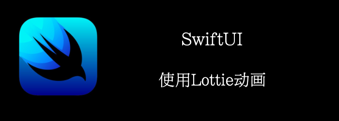

SwiftUi使用Lottie动画还得借助于UIKit。

我们来看看如何在SwiftUI中使用Lottie动画。
<!--truncate-->
## Getting ready

新建一个SwiftUI工程

pod中加入`pod 'lottie-ios'`

准备好一个lottie动画的json文件

## How to do it…

1. 创建一个LottieAnimation,把UIKit的Lottie包裹为SwiftUI View
```swift
import Lottie
import SnapKit

struct LottieAnimation: UIViewRepresentable {
    private let animationView = AnimationView()
    var animationName = ""
    @Binding var play: Bool

    func makeUIView(context: Context) -> some UIView {
        let view = UIView()
        animationView.animation = Animation.named(animationName)
        animationView.contentMode = .scaleAspectFit
        animationView.scalesLargeContentImage = true
        view.addSubview(animationView)
        animationView.snp.makeConstraints { make in
            make.edges.equalToSuperview()
        }
        return view
    }

    func updateUIView(_ uiView: UIViewType, context: Context) {
        guard play else { return }
        animationView.play { _ in
            play = false
        }
    }
}
```

2. 添加View到ContentView中
```swift
struct ContentView: View {
    @State var play = false

    var body: some View {
        ZStack {
            Color.yellow.edgesIgnoringSafeArea(.all)
            VStack {
                LottieAnimation(animationName:"fill-heart",play: $play)
                    .padding(.horizontal, 30)
                Button {
                      play = true
                } label: {
                    Text("Fill me!")
                        .fontWeight(.heavy)
                        .padding(15)
                        .background(.white)
                        .cornerRadius(10)
                }

            }
        }
    }
}
```


## How it works…

Lottie有个**AnimationView**，我们设置动画的名称就可以进行动画。

但其是UIView的子类，所以我们需要将其包裹为一个SwiftUI View。

同时我们提供了play来控制是否进行动画。
