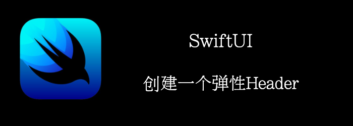

什么是弹性Header？还记得你有个TableView，header是一个图片，当往下拉动tableview时，header的图片会放大。

本文将用SwiftUI实现一个类似的效果。
<!--truncate-->
## Getting ready

首先创建一个新的项目：**StretchableHeader**

准备2张图片。

## How to do it…

1. 我们创建一个Row， 类似于Tableview的cell
```swift
struct Row: View {
    var body: some View {
        HStack {
            Image("avatar")
                .resizable()
                .frame(width: 50, height: 50)
                .clipShape(Circle())
            Spacer()
            VStack(alignment: .trailing) {
                Text("Billie Eilish")
                    .fontWeight(.heavy)
                Text("Happier Than Ever")
            }
        }.padding(.horizontal, 15)
    }
}
```

2. 准备一个列表
```swift
struct ContentView: View {
    
    var body: some View {
        ScrollView(.vertical, showsIndicators: false) {
            VStack {
                ForEach(0..<6) { _ in
                    Row()
                    Divider()
                }

            }
        }.edgesIgnoringSafeArea(.all)
    }
}
```

3. 创建我们的弹性Header
```swift
extension GeometryProxy {
    private var offset: CGFloat {
        frame(in: .global).minY
    }
    var height: CGFloat {
        size.height + (offset > 0 ? offset : 0)
    }

    var verticalOffset: CGFloat {
        offset > 0 ? -offset : 0
    }
}

struct StretchableHeader: View {
    let imageName: String
    var body: some View {
        GeometryReader { geometry in
            Image(self.imageName)
                .resizable()
                .scaledToFill()
                .frame(width: geometry.size.width, height: geometry.height)
                .offset(y: geometry.verticalOffset)
        }.frame(height: 350)
    }
}
```

4. 添加到Vstack中
```swift
struct ContentView: View {
//...
    VStack {
        StretchableHeader(imageName: "header")
        ForEach(0..<6) { _ in
//...
}
```


## How it works…

诀窍在于我们计算verticalOffset的方式：当我们尝试向下滑动图像时，图像顶部变得大于**0**，因此我们应用负偏移来补偿由滑动引起的偏移，并且图像贴在顶部。

高度也是一样：当图像向上移动时，高度是正常的，但是当它被粘到顶部后向下移动时，高度会随着拖动而增加。

请注意，图像是用**.scaledToFill()**修改的，这样当e 高度增加， 宽度按比例增加，并且 有放大效应。