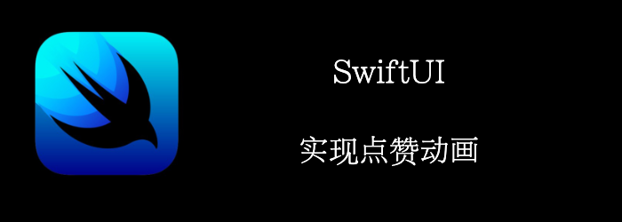

还记得各种直播间中的底部不断飘起各种颜色的小红心么？

我们来实现一个这种效果。
<!--truncate-->
## Getting ready

新建一个项目：**FloatingHearts**

引入三方库：pod "SwiftCubicSpline"，来实现小红心漂移路径。

## How to do it…

1. 首先，实现我们的动效
```swift
import SwiftCubicSpline

struct MoveShakeScale: GeometryEffect {
    private(set) var pct: CGFloat
    private let xPosition = UIScreen.main.bounds.width/4 + CGFloat.random(in: -20..<20)
    private let scaleSpline = CubicSpline(points: [
        Point(x: 0, y: 0.0),
        Point(x: 0.3, y: 3.5),
        Point(x: 0.4, y: 3.1),
        Point(x: 1.0, y: 2.1),
    ])

    private let xSpline = CubicSpline(points: [
        Point(x: 0.0,  y: 0.0),
        Point(x: 0.15, y: 20.0),
        Point(x: 0.3,  y: 12),
        Point(x: 0.5,  y: 0),
        Point(x: 1.0,  y: 8),
    ])

    var animatableData: CGFloat {
        get { pct }
        set { pct = newValue }
    }
    
    func effectValue(size: CGSize) -> ProjectionTransform {
        let scale = scaleSpline[x: Double(pct)]
        let xOffset = xSpline[x: Double(pct)]
        let yOffset = UIScreen.main.bounds.height/2 - pct * UIScreen.main.bounds.height/4*3
        let transTrasf = CGAffineTransform(translationX: xPosition + CGFloat(xOffset), y: yOffset)
        let scaleTrasf = CGAffineTransform(scaleX: CGFloat(scale), y: CGFloat(scale))
        return ProjectionTransform(scaleTrasf.concatenating(transTrasf))
    }
}
```

2. 定义我们的桃心View
```swift

extension Color {
    init(r: Double, g: Double, b: Double) {
      self.init(red: r/255, green: g/255, blue: b/255)
    }
    static func random() -> Color {
        Color(r: .random(in: 100...144),
              g: .random(in: 10...200),
              b: .random(in: 200...244))
    }
}
@available(iOS 15.0, *)
struct Heart: View, Identifiable {
    let id = UUID()
    @State private var opacity = 1.0
    @State private var scale: CGFloat = 1.0
    @State private var toAnimate = false
    var body: some View {
        Image(systemName: "heart.fill")
            .foregroundColor(.random())
            .opacity(opacity)
            .modifier(MoveShakeScale(pct: toAnimate ? 1 : 0))
            .animation(Animation.easeIn(duration:5.0), value: toAnimate)
            .task {
                toAnimate.toggle()
                withAnimation(.easeIn(duration: 5)) {
                    opacity = 0
                }
            }
    }
}
@available(iOS 15.0, *)
extension Heart: Equatable {
    static func == (lhs: Heart, rhs: Heart) -> Bool {
        lhs.id == rhs.id
    }
}
extension Array where Element: Equatable {
    mutating func remove(object: Element) {
        guard let index = firstIndex(of: object) else { return }
        remove(at: index)
    }

}
@available(iOS 15.0, *)
class Hearts: ObservableObject {
    @Published
    private(set) var all: [Heart] = []

    func new() {
        let heart = Heart()
        all.append(heart)
        DispatchQueue.main.asyncAfter(deadline: .now() + 10.0) {
            self.all.remove(object: heart)
        }
    }
}
@available(iOS 15.0, *)
struct HeartsView: View {
    @ObservedObject
    var hearts: Hearts
    var body: some View {
        ForEach(hearts.all) { $0 }
    }
}

```

3. 添加到ContentView中
```swift
struct ContentView: View {
    var hearts = Hearts()
    var body: some View {
        VStack {
            Spacer()
            HStack {
                Button {
                    hearts.new()
                } label: {
                    Image(systemName: "heart")
                        .font(.title)
                        .frame(width: 80, height: 80)
                        .foregroundColor(.white)
                        .background(.blue)
                        .clipShape(Circle())
                        .shadow(radius: 10)
                    }
                    Spacer()
                }.padding(.horizontal, 30)
            }
            .overlay(HeartsView(hearts: hearts))
        }
}
```


## How it works…

基本思想是让四个动画并行：

- 从底部移动到顶部
- 变淡
- 放大和缩小
- 向上移动时轻微晃动

水平运动的曲线是一种锯齿形，我们使用**SwiftCubicSpline**库来进行插值。


GeometryEffect返回一系列的transformation应用到View上。这里我们使用时间作为动画属性，计算出移动和缩放的值，把这两个作为一个transform应用到View上。

透明度的变化是线性的，不能是曲线，所以单独处理。

动画结束后似乎没有什么回调供我们调用，因此我们使用DispatchQueue.main.asyncAfter来移除

```swift
DispatchQueue.main.asyncAfter(deadline: .now() + 10.0) {
    self.all.remove(object: heart)
}
