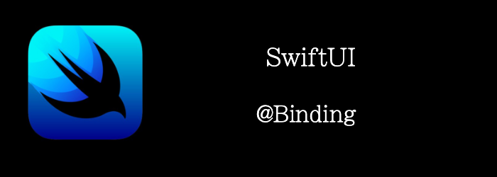

我们上一篇讲了@State，如果我们有其他VIew要修改我们的State呢？

在TodoList demo 中，todos array是struct，是值类型，如果我们传递state到child view，那么传递的是值的copy。当child view修改array时，并不能反映到parent view的array中，所以也看不到变化。

SwiftUI通过**@Binding**解决这个问题，其本质上可以看成是生成一个对get和set方法的封装struct。

我们将沿用上一个TodoList的demo来看看@Binding的使用。
<!--truncate-->
## Getting ready

沿用上一个TodoList的项目，如果你新建项目的话，可以拷贝如下代码到项目。

```swift
struct Todo: Identifiable {
    let id = UUID()
    let description: String
    var done: Bool
}

@available(iOS 15.0, *)
struct ContentView: View {
    @State var todos = [
        Todo(description: "review the first chapter", done: false),
        Todo(description: "buy wine", done: false),
        Todo(description: "paint kitchen", done: false),
        Todo(description: "cut the grass", done: false),
    ]    
    var body: some View {
        List($todos) { $todo in
            HStack {
                Text(todo.description).strikethrough(todo.done)
                Spacer()
                Image(systemName:todo.done ? "checkmark.square" : "square")
            }
            .contentShape(Rectangle())
            .onTapGesture {
                todo.done.toggle()
            }
        }
    }
}
```

## How to do it…

1. 创建一个新的View来添加新的todo
```swift
@available(iOS 15.0, *)
struct InputTodoView: View {
    @Binding var todos: [Todo]
    @State private var newTodoDescription: String = ""
    var body: some View {
        HStack {
            TextField("Todo", text: $newTodoDescription)
                .textFieldStyle(.roundedBorder)
            Spacer()
            Button {
                guard !newTodoDescription.isEmpty else { return }
                todos.append(Todo(description: newTodoDescription, done: false))
                newTodoDescription = ""
            } label: {
                Text("Add")
                    .padding(.horizontal, 16)
                    .padding(.vertical, 8)
                    .foregroundColor(.white)
                    .background(.green)
                    .cornerRadius(5)
            }
        }.frame(height: 60)
        .padding(.horizontal, 24)
        .padding(.bottom, 30)
        .background(Color.gray)
    }
}
```

2. 将InputTodoView添加到界面上
```swift
var body: some View {
    ZStack(alignment: .bottom) {
        List($todos) { $todo in
            HStack {
                Text(todo.description).strikethrough(todo.done)
                Spacer()
                Image(systemName:todo.done ? "checkmark.square" : "square")
            }
            .contentShape(Rectangle())
            .onTapGesture {
                todo.done.toggle()
            }
        }
        InputTodoView(todos: $todos)
    }.edgesIgnoringSafeArea(.bottom)        
}
```


## How it works…

就像我们开头说的那样，children要修改parent的state，parent直接吧state传递给children是不行的，因为传递的是值的copy。

SwiftUI使用**@Binding** 创建一个双向绑定

- parent的变化会反应到children上
- children的变化也会反映到parent上

我们在children声明state时，使用@Binding，parent传入时传的是$state，而不是state。$操作符的意思是获取State结构体中的projectedValue属性。我们可以看到State结构体的projectedValue正是一个Binding类型。

```swift
var projectedValue: Binding<Value> { get }
```

## 深入了解@Binding

我们首先来看看，Binding结构体的Api

```swift
@frozen @propertyWrapper @dynamicMemberLookup struct Binding<Value>
// Creating a Binding
init<V>(Binding<V>)
init(get: @escaping () -> Value, set: @escaping (Value, Transaction) -> Void)
init(get: @escaping () -> Value, set: @escaping (Value) -> Void)
```

我们可以看到2点

- Binding是能够进行dynamicMemberLookup，也就是说我们能够使用`$state.someproperty`这样的方式来进行访问，这返回什么呢？得看他的subscript是怎么实现的，我们稍后再看
- 我们看到初始化方法，就是get和set方法，正如开头说的那样。可以把Binding看成是get和set方法的一个封装。

有了这两点了解，我们来实现一个我们自己的@MyBinding。

首先，定义一个property wrapper，包含一个get和set方法。

```swift
@propertyWrapper
struct MyBinding<T> {
    private let getValue: () -> T
    private let setValue: (T) -> Void
    var wrappedValue: T {
        get {
            return getValue()
        }
        nonmutating set {
            setValue(newValue)
        }
    }
    
    var projectedValue: Self { self }
    
    init(getValue: @escaping () -> T, setValue: @escaping (T) -> Void) {
        self.getValue = getValue
        self.setValue = setValue
    }
}
```

### 补全@MyState

我们来用一下试一试，补全下上一篇文章的@MyState

```swift
final class Box<T>: ObservableObject {
    @Published var value: T
    init(_ value: T) {
        self.value = value
    }
}
// highlight-start
@propertyWrapper
struct MyBinding<T> {
    private let getValue: () -> T
    private let setValue: (T) -> Void
    var wrappedValue: T {
        get {
            return getValue()
        }
        nonmutating set {
            setValue(newValue)
        }
    }
    
    var projectedValue: Self { self }
    
    init(getValue: @escaping () -> T, setValue: @escaping (T) -> Void) {
        self.getValue = getValue
        self.setValue = setValue
    }
}
// highlight-end
@propertyWrapper
struct MyState<T>: DynamicProperty {
    @ObservedObject var box: Box<T>
    var wrappedValue: T {
        get {
            return box.value
        }
        nonmutating set {
            box.value = newValue
        }
    }
  // highlight-start
    var projectedValue: MyBinding<T> {
        return MyBinding {
            return box.value
        } setValue: { newValue in
            box.value = newValue
        }
    }
  // highlight-end
    init(wrappedValue: T) {
        self._box = ObservedObject(wrappedValue: Box<T>(wrappedValue))
    }
}
// highlight-start
struct ChildView: View {
  //使用我们自己MyBinding
    @MyBinding var text: String
    var body: some View {
        VStack {
            Text("this is children: \(text)")
            Button {
                text = "\(Int.random(in: 200...300))"
            } label: {
                Text("change from child")
            }
        }
    }
}
// highlight-end
@available(iOS 15.0, *)
struct ContentView: View {
    @MyState var text = "hello world123"
    var body: some View {
        VStack {
            Text("\(text)")
            Button {
                text = "\(Int.random(in: 0...100))"
            } label: {
                Text("change")
            }
            ChildView(text: $text)
        }
    }
}

```


现在我们已经补全了@MyState，能够使用$text了。

### 实现dynamicMemberLookup

Ok，我们刚刚能够使用`$text`了，但是如果我们想要用`$state.somePropert`呢, 我们试一试

```swift
struct ChildView: View {
  // highlight-start
  //我们改下chidlrenView，显示字符串的数量，也就是text.count
    @MyBinding var textCount: Int
    // highlight-end
    var body: some View {
        VStack {
            Text("this show textCount: \(textCount)")
        }
    }
}

struct ContentView: View {
    @MyState var text = "hello world123"
    var body: some View {
        VStack {
            Text("\(text)")
            Button {
                text = "\(Int.random(in: 0...100))"
            } label: {
                Text("change")
            }
            // highlight-start
          // 改下传参，但是报错了，因为我们的MyBinding不支持这种语法
            ChildView(textCount: $text.count)
            // highlight-end
        }
    }
}
```

所以，我们用dynamicMemberLookup修饰下MyBinding。

```swift
@propertyWrapper
// highlight-start
@dynamicMemberLookup
// highlight-end
struct MyBinding<T> {
    ...
  // highlight-start
    subscript<Sub>(dynamicMember keyPath: WritableKeyPath<T, Sub>) -> MyBinding<Sub> {
        return MyBinding<Sub> {
            return self.wrappedValue[keyPath: keyPath]
        } setValue: { newValue in
            self.wrappedValue[keyPath: keyPath] = newValue
        }
    }
  // highlight-end
}
```

我们来用一下：

```swift
struct ChildView: View {
    @MyBinding var name: String
    var body: some View {
        VStack {
            Text("name is: \(name)")
            Button {
                name = "child\(Int.random(in: 1...100))"
            } label: {
                Text("点击修改name")
            }
        }
    }
}

struct Person {
    var name = ""
    var age = 20
}

@available(iOS 15.0, *)
struct ContentView: View {
    @MyState var person = Person(name:"hello")
    var body: some View {
        VStack {
            Text("person name:\(person.name) age: \(person.age)")
            Button {
                person.name = "parent\(Int.random(in: 200...300))"
            } label: {
                Text("change")
            }
            ChildView(name: $person.name)
        }
    }
}
```


不错，我们成功使用了`$person.name`。

至此，我们对Binding已经有了一定的了解，也知道了$操作符的原理，以及$state.someProperty的原理。
