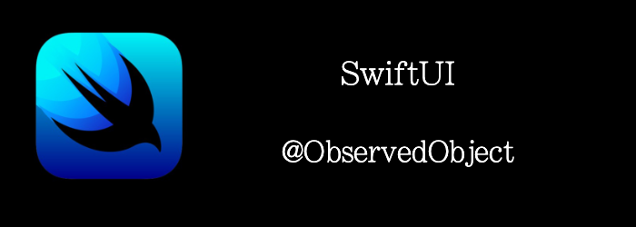

我们使用@State时有一点我们可能并没有注意到，那就是多数时候都是修饰的都是值类型，如果我们用@State去修饰引用类型呢？这就要小心了，因为改变引用类型内部的变量，SwiftUI并不能感知到，所以你的修改可能并不能反应到UI上。

那我们确实需要修饰引用类型呢？这个时候就需要@ObservedObject。

@ObservedObject修饰的对象需要遵循**ObservableObject**协议，同时需要被监听的属性还需要用**@Published**修饰。

这在将Foundation的一些对象桥接到SwiftUI中会非常有用。本文我们将用**CoreLocation**为例来演示一下@ObservedObject。
<!--truncate-->
## Getting ready

首先，新建一个SwiftUI工程：**SwiftUICoreLocation**

**PROJECT** > **Info** 中添加获取定位的key：**NSLocationWhenInUseUsageDescription**，并设置一个提示信息。

## How to do it…

我们准备将**CLLocationManager**包装为**ObservableObject**，然后暴露两个属性

- location的状态
- 当前location

1. 首先，我们创建一个LocationManager
```swift
class LocationManager: NSObject, ObservableObject {
    private let locationManager = CLLocationManager()
    @Published var status: CLAuthorizationStatus?
    @Published var current: CLLocation?
    override init() {
        super.init()
        self.locationManager.delegate = self
        self.locationManager.distanceFilter = 10
        self.locationManager.desiredAccuracy = kCLLocationAccuracyBest
        self.locationManager.requestWhenInUseAuthorization()
        self.locationManager.startUpdatingLocation()
    }
}

extension LocationManager: CLLocationManagerDelegate {
    func locationManagerDidChangeAuthorization(_ manager: CLLocationManager) {
        self.status = manager.authorizationStatus
    }
    
    func locationManager(_ manager: CLLocationManager, didUpdateLocations locations: [CLLocation]) {
        guard let location = locations.last else { return }
        self.current = location
    }
}

extension Optional where Wrapped == CLAuthorizationStatus {
    var description: String {
        guard let self = self else {
            return "unknown"
        }
        switch self {
        case .notDetermined: return "notDetermined"
        case .authorizedWhenInUse: return "authorizedWhenInUse"
        case .authorizedAlways: return "authorizedAlways"
        case .restricted: return "restricted"
        case .denied: return "denied"
        @unknown default: return "unknown"
        }
    }
}

extension Optional where Wrapped == CLLocation {
    var latitudeDescription: String {
        guard let self = self else {
            return "-"
        }
        return "\(self.coordinate.latitude)"
    }
    var longitudeDescription: String {
        guard let self = self else {
            return "-"
        }
        return "\(self.coordinate.longitude)"
    }
}
```

2. 使用我们的LocationManager
```swift
struct ContentView: View {
    @ObservedObject var locationManager = LocationManager()
    var body: some View {
        VStack {
            Text("Status: \(locationManager.status.description)")
            HStack {
                Text("Latitude: \(locationManager.current.latitudeDescription)")
                Text("Longitude: \(locationManager.current.longitudeDescription)")

            }
        }
    }
}
```


## How it works…

你可以认为**@Published**是一种自动的property observer，当value改变时，能够发出一个通知。

而你用**@ObservedObject** 修饰的会接受到通知，并重新渲染UI。

**@Published** 是 **Combine** publisher的一个语法糖，我们之后会了解他。
