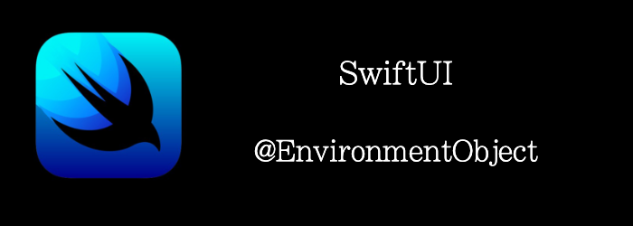

有时我们必须在多个视图之间共享数据，比如：ThemeManager。

如果你通过View层级一层一层传递，那实在是太烦了。

SwiftUI 通过 **Environment** 的概念来解决这个问题, 在那添加公共对象(通常都是ObservableObject), 这些对象会在View chain中共享 。

我们来看一个例子。
<!--truncate-->
## Getting ready

首先，创建一个新的项目：**SongPlayer**

再找6张图片，作为歌曲封面，添加到项目的**Assets**下。

## How to do it…

1. 创建Song的Model
```swift
struct Song: Identifiable, Equatable {
    var id = UUID()
    let artist: String
    let name: String
    let cover: String
}
```

2. 让我们添加个播放器，保存当前播放的歌曲，并提供一个播放方法
```swift
class MusicPlayer: ObservableObject {
    @Published var currentSong: Song?
    func pressButton(song: Song) {
        if currentSong == song {
            currentSong = nil
        } else {
            currentSong = song
        }
    }
}
```

3. 实现一个播放按钮
```swift
struct PlayButton: View {
    @EnvironmentObject
    private var musicPlayer: MusicPlayer
    let song: Song
    private var buttonText: String {
        if song == musicPlayer.currentSong {
            return "stop"
        } else {
            return "play"
        }
    }

    var body: some View {
        Button {
            musicPlayer.pressButton(song: song)
        } label: {
            Image(systemName: buttonText)
                .font(.system(.largeTitle))
                .foregroundColor(.black)
        }
    }
}
```

4. 实现播放列表的cell
```swift
struct SongView: View {
    @EnvironmentObject
    private var musicPlayer: MusicPlayer
    let song: Song
    var body: some View {
        HStack {
            NavigationLink(destination:PlayerView(song: song)) {
                Image(song.cover)
                    .renderingMode(.original)
                    .resizable()
                    .aspectRatio(contentMode: .fill)
                    .frame(width: 100, height: 100)
                VStack(alignment: .leading) {
                    Text(song.name)
                    Text(song.artist).italic()
                }
            }

            Spacer()

            PlayButton(song: song)

        }.buttonStyle(PlainButtonStyle())
    }
}
```

5. 实现播放详情View
```swift
struct PlayerView: View {
    @EnvironmentObject
    private var musicPlayer: MusicPlayer
    let song: Song
    var body: some View {
        VStack {
            Image(song.cover)
                .renderingMode(.original)
                .resizable()
                .aspectRatio(contentMode: .fill)
                .frame(width: 300, height: 300)
            HStack {
                Text(song.name)
                Text(song.artist).italic()
            }
            PlayButton(song: song)
        }
    }
}
```

6. 实现一个mini播放器VIew
```swift
struct MiniPlayerView: View {
    @EnvironmentObject
    private var musicPlayer: MusicPlayer

    var body: some View {
        if let currentSong = musicPlayer.currentSong {
            SongView(song: currentSong)
                .padding(.all, 24)
        } else {
            EmptyView()
        }
    }
}
```

7. 在ContentView中准备好数据，显示播放列表
```swift
struct ContentView: View {
    @EnvironmentObject
    private var musicPlayer: MusicPlayer

    private let songs = [
        Song(artist: "Luke", name: "99", cover: "cover0"),
        Song(artist: "Foxing", name: "No Trespassing", cover: "cover1"),
        Song(artist: "Breaking Benjamin", name: "Phobia", cover: "cover2"),
        Song(artist: "J2", name: "Solenoid", cover: "cover3"),
        Song(artist: "Wildflower Clothing", name: "Lightning Bottles", cover: "cover4"),
        Song(artist: "The Broken Spirits", name: "Rubble", cover: "cover5"),
    ]

    var body: some View {
        ZStack(alignment: .bottom) {
            NavigationView {
                List(self.songs) { song in
                    SongView(song: song)
                }
                .listStyle(.plain)
                .navigationTitle("Music Player")
            }
            MiniPlayerView()
                .background(.gray)
                .offset(y: 44)
        }
    }
}
```

8. 设置preview的environmentObject，这样在预览中就能看到
```swift
struct ContentView_Previews: PreviewProvider {
    static var previews: some View {
        ContentView().environmentObject(MusicPlayer())
    }
}
```


## How it works…

每个View都会被他的ancestors设置Environment，然后view可以从Environment中获取value，只需要标记为@EnvironmentObject。

你可以把Environment认为是一个HashMap，key是对象的类型，value是对于的值。

由此，我们可以推断在**Environment **不能有两个相同类型的对象，不过这通常不是问题，我们有别的方法解决。
