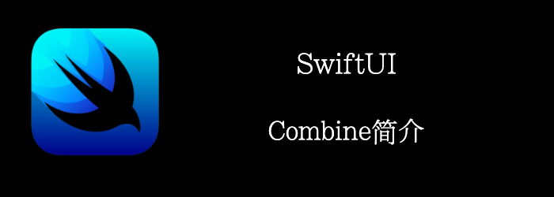

我们还是来看个**CoreLocation**的例子。
<!--truncate-->
## Getting ready

新建一个项目：**CombineCoreLocationManager**

**PROJECT** > **Info**中添加获取定位权限Key：**NSLocationWhenInUseUsageDescription**

## How to do it…

1. 首先实现个LocationManager，封装一下CLLocationManager。
```swift
import CoreLocation
import SwiftUI
class LocationManager: NSObject {
    enum LocationError: String, Error {
        case restricted
        case denied
        case unknown
    }

    private let locationManager = CLLocationManager()

    override init() {
        super.init()
        self.locationManager.delegate = self
        self.locationManager.desiredAccuracy = kCLLocationAccuracyBest
        self.locationManager.requestWhenInUseAuthorization()
    }

    func start() {
        self.locationManager.startUpdatingLocation()
    }
}
```

2. 目前为止和Combine还没什么关系，我们继续添加2个Publisher
```swift
class LocationManager: NSObject {
  ...
  let statusPublisher = PassthroughSubject<CLAuthorizationStatus, LocationError>()
	let locationPublisher = PassthroughSubject<CLLocation?, Never>()
  ...
}

```

3. 然后我们实现CLLocationManagerDelegate，把回调的value转发给publisher
```swift
extension LocationManager: CLLocationManagerDelegate {
    func locationManagerDidChangeAuthorization(_ manager: CLLocationManager) {
        switch manager.authorizationStatus {
        case .restricted: self.statusPublisher.send(completion: .failure(.restricted))
        case .denied: self.statusPublisher.send(completion: .failure(.denied))
        case .notDetermined, .authorizedAlways,.authorizedWhenInUse:
            self.statusPublisher.send(manager.authorizationStatus)
        @unknown default:
            self.statusPublisher.send(completion: .failure(.unknown))
        }
    }

    func locationManager(_ manager: CLLocationManager, didUpdateLocations locations: [CLLocation]) {
        guard let location = locations.last else { return }
        locationPublisher.send(location)
    }
}
```

3. 创建一个**LocationViewModel**，用于提供界面显示的数据
```swift
extension Optional where Wrapped == CLLocation {
    var latitudeDescription: String {
        guard let self = self else {
            return "-"
        }
        return String(format: "%0.4f", self.coordinate.latitude)
    }

    var longitudeDescription: String {
        guard let self = self else {
            return "-"
        }
        return String(format: "%0.4f", self.coordinate.longitude)
    }
}

class LocationViewModel: ObservableObject {
    @Published
    private var status: CLAuthorizationStatus = .notDetermined
    @Published
    private var currentLocation: CLLocation?
    @Published
    var errorMessage = ""
    private let locationManager = LocationManager()

    private var cancellableSet: Set<AnyCancellable> = []
    init() {
        self.locationManager
            .statusPublisher
            .debounce(for: 0.5, scheduler: RunLoop.main)
            .removeDuplicates()
            .sink { completion in
                switch completion {
                case .finished: break
                case let .failure(error):
                    self.errorMessage = error.rawValue
                }
            } receiveValue: { self.status = $0 }
            .store(in: &self.cancellableSet)

        self.locationManager.locationPublisher
            .debounce(for: 0.5, scheduler: RunLoop.main)
            .removeDuplicates(by: self.lessThanOneMeter)
            .assign(to: \.currentLocation, on: self)
            .store(in: &self.cancellableSet)
    }

    private func lessThanOneMeter(_ lhs: CLLocation?, _ rhs: CLLocation?) -> Bool {
        if lhs == nil && rhs == nil {
            return true
        }
        guard let lhr = lhs,
              let rhr = rhs else {
            return false
        }
        return lhr.distance(from: rhr) < 1
    }

    func startUpdating() {
        self.locationManager.start()
    }

    // 准备UI数据
    var thereIsAnError: Bool {
        !self.errorMessage.isEmpty
    }

    var latitude: String {
        self.currentLocation.latitudeDescription
    }

    var longitude: String {
        self.currentLocation.longitudeDescription
    }

    var statusDescription: String {
        switch self.status {
        case .notDetermined: return "notDetermined"
        case .authorizedWhenInUse: return "authorizedWhenInUse"
        case .authorizedAlways: return "authorizedAlways"
        case .restricted: return "restricted"
        case .denied: return "denied"
        @unknown default: return "unknown"
        }
    }
}
```

4. 然后再ContentView中使用
```swift
struct ContentView: View {
    @StateObject var locationViewModel = LocationViewModel()
    var body: some View {
        Group {
            if locationViewModel.thereIsAnError {
                Text("Location Service terminated with error:\(locationViewModel.errorMessage)")
            } else {
                Text("Status:\(locationViewModel.statusDescription)")
                HStack {
                    Text("Latitude: \(locationViewModel.latitude)")
                    Text("Longitude:\(locationViewModel.longitude)")
                }
            }
        }.padding(.horizontal, 24)
        .task {
            locationViewModel.startUpdating()
        }
    }
}
```


## How it works…

首先你可能注意到我们 **@Published** 修饰的是 **private**变量，你可能感到奇怪，通常我们都是设置为Public，这样能够让外部访问，不过我们这里是ViewModel，数据需要被加工后才能使用，所以我们隐藏原始数据，暴露加工后的数据。

首先，我们在LocationManager中定义了2个publisher，他们是Subject。subject是管理输入的，有一个`.send`方法来发送event。常用的subject是：**CurrentValueSubject** 和 **PassthroughSubject**。

CurrentValueSubject有初始值，自己维护改变的值，即使没有任何subscribers。

PassthroughSubject没有初始值，如果没有subscribers，收到的值会被抛弃。

```swift
//可以类比RxSwift的onEvent, onError, onCompleted
// 发送event
statusPublisher.send(status)
//发送finish
statusPublisher.send(completion: .finish)
//发送失败
statusPublisher.send(completion: .failure(.restricted))
```

然后我们再来看看subscribe，我们在Init方法中做的subscribe。

```swift
locationManager.locationPublisher
	// 节流
    .debounce(for: 0.5, scheduler: RunLoop.main)
	// 移除重复
    .removeDuplicates(by: lessThanOneMeter)
	// 相当于rxswift的 subscribe
    .assign(to: \.currentLocation, on: self)
	// 相当于rxswift的 addToDisposeBag()
    .store(in: &cancellableSet)// cancellableSet相当于DisposeBag
```

`sink`可以同时接受completion状态和recivedValue，可以更精确的处理数据。
