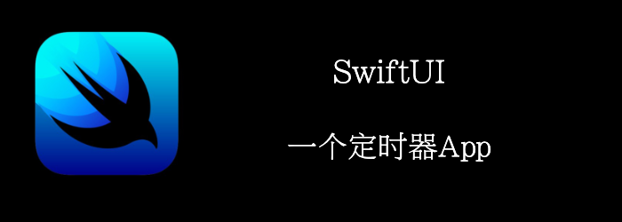

当我们subscribe一个publisher后，这个结果需要存储到某个地方，通常我们都是通过调用`.store`方法存储在某个 **AnyCancellable Set**中。但是每个都这么用，可能会显得有点重复，我们将用@ResultBuilder来包裹所有的subscribtion，将所有AnyCancellable放到同一个set中。

我们来看一个定时器的例子。
<!--truncate-->
## Getting ready

首先，新建一个项目：**StopWatch**

## How to do it…

1. 构建数据model
```swift
class StopWatchTimer: ObservableObject {
    @Published var deciseconds: Int = 0
    @Published var seconds: Int = 0
    @Published var minutes: Int = 0
    @Published var started = false
    private var cancellableSet: Set<AnyCancellable> = []

    func start() {
    }

    func stop() {
    }
}
```

2. 实现start和stop
```swift
func stop() {
    cancellableSet = []
    started = false
}

func start() {
    cancellableSet.store {
        Timer.publish(every: 0.1, on: RunLoop.main)
            .autoconnect()
            .sink { _ in
                self.deciseconds = (self.deciseconds + 1)%10
            }
        Timer.publish(every: 1.0, on: RunLoop.main)
            .autoconnect()
            .sink { _ in
                self.seconds = (self.seconds + 1)%60
            }
        Timer.publish(every: 60, on: RunLoop.main)
            .autoconnect()
            .sink { _ in
                self.minutes = (self.minutes + 1)%60
            }
    }
  started = true
}
```

3. 实现`cancellableSet.store`方法
```swift
typealias CancellableSet = Set<AnyCancellable>
extension CancellableSet {
    mutating func store(@CancellableBuilder _ cancellables: () -> [AnyCancellable]) {
        formUnion(cancellables())
    }

    @resultBuilder
    struct CancellableBuilder {
        static func buildBlock(_ cancellables:AnyCancellable...) -> [AnyCancellable] {
            return cancellables
        }
    }
}

```

4. 实现UI

```swift
extension Int {
    var formatted: String {
        String(format: "%02d", self)
    }
}

@available(iOS 15.0, *)
struct ContentView: View {
    @StateObject private var timer = StopWatchTimer()
    var body: some View {
        VStack(spacing: 12) {
            HStack(spacing: 0) {
                Text("\(timer.minutes.formatted)")
                    .font(.system(size: 80))
                    .frame(width: 100)
                Text(":")
                    .font(.system(size: 80))
                Text("\(timer.seconds.formatted)")
                    .font(.system(size: 80))
                    .frame(width: 100)
                Text(":")
                    .font(.system(size: 80))
                Text("\(timer.deciseconds.formatted)")
                    .font(.system(size: 80))
                    .frame(width: 100)
            }
            Button {
                if timer.started {
                    timer.stop()
                } else {
                    timer.start()
                }
            } label: {
                Text(timer.started ? "Stop" : "Start")
                    .foregroundColor(.white)
                    .padding(.horizontal, 24)
                    .padding(.vertical, 16)
                    .frame(width: 100)
                    .background(timer.started ? Color.red : Color.green)
                    .cornerRadius(5)
            }
        }
    }
}
```


## How it works…

首先我们学习了`Timer.publish`，知道了如何生成时间。

然后**.autoconnect()**让publisher立马开始。

最后，我们使用了@ResultBuilder，这样在builder闭包中的多个subscribe产生的**AnyCancellable**就会被收集起来放到cancellableSet中。
