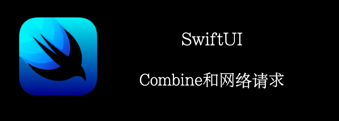

我们将使用**OpenWeather**上的Api创建一个天气App，显示最近5天的天气。
<!--truncate-->
## Getting ready

新建一个项目**Weather**

到OpenWeather上注册个账号，拿到一个ApiKey。

## How to do it…

1. 首先，创建Model
```swift
struct Weather: Decodable, Identifiable {
    var id: TimeInterval { time.timeIntervalSince1970 }
    let time: Date
    let summary: String
    let icon: String
    let temperature: Double
    
    enum CodingKeys: String, CodingKey {
        case time = "dt"
        case weather = "weather"
        case summary = "description"
        case main = "main"
        case icon = "icon"
        case temperature = "temp"
    }
    
    init(from decoder: Decoder) throws {
        let container = try decoder.container(keyedBy: CodingKeys.self)
        time = try container.decode(Date.self, forKey: .time)
        var weatherContainer = try container.nestedUnkeyedContainer(forKey: .weather)
        let weather = try weatherContainer.nestedContainer(keyedBy: CodingKeys.self)
        summary = try weather.decode(String.self, forKey: .summary)
        icon = try weather.decode(String.self, forKey: .icon)
        let main = try container.nestedContainer(keyedBy: CodingKeys.self, forKey: .main)
        temperature = try main.decode(Double.self, forKey: .temperature)
    }
}

struct ForecastWeather: Decodable {
    let list: [Weather]
}

extension Double {
    var formatted: String {
        String(format: "%.0f", self)
    }
}
extension String {
    var weatherIcon: String {
        switch self {
        case "01d": return "sun.max"
        case "02d": return "cloud.sun"
        case "03d": return "cloud"
        case "04d": return "cloud.fill"
        case "09d": return "cloud.rain"
        case "10d": return "cloud.sun.rain"
        case "11d": return "cloud.bolt"
        case "13d": return "cloud.snow"
        case "50d": return "cloud.fog"
        case "01n": return "moon"
        case "02n": return "cloud.moon"
        case "03n": return "cloud"
        case "04n": return "cloud.fill"
        case "09n":return "cloud.rain"
        case "10n": return "cloud.moon.rain"
        case "11n": return "cloud.bolt"
        case "13n": return "cloud.snow"
        case "50n": return "cloud.fog"
        default: return "icloud.slash"
        }
    }
}
```

2. 创建我们的ViewModel
```swift
class WeatherService: ObservableObject {
    @Published var errorMessage: String = ""
    @Published var current: Weather?
    @Published var forecast: [Weather] = []

    private let apiKey = "Your ApiKey"
    private var cancellableSet: Set<AnyCancellable> = []

    func load(latitude: Float, longitude: Float) {
        let decoder = JSONDecoder()
        decoder.dateDecodingStrategy = .secondsSince1970
        let currentURL = URL(string: "https://api.openweathermap.org/data/2.5/weather?lat=\(latitude)&lon=\(longitude)&appid=\(apiKey)&units=metric")!
        URLSession
            .shared
            .dataTaskPublisher(for: URLRequest(url: currentURL))
            .map(\.data)
            .decode(type: Weather.self, decoder: decoder)
            .receive(on: RunLoop.main)
            .sink { completion in
                switch completion {
                case .finished: break
                case let .failure(error):
                    self.errorMessage = error.localizedDescription
                }
            } receiveValue: {
                self.current = $0
            }
            .store(in: &self.cancellableSet)

        let forecastURL = URL(string: "https://api.openweathermap.org/data/2.5/forecast?lat=\(latitude)&lon=\(longitude)&appid=\(apiKey)&units=metric")!
        URLSession
            .shared
            .dataTaskPublisher(for: URLRequest(url: forecastURL))
            .map(\.data)
            .decode(type: ForecastWeather.self, decoder: decoder)
            .receive(on: RunLoop.main)
            .sink { completion in
                switch completion {
                case .finished: break
                case let .failure(error):
                    self.errorMessage = error.localizedDescription
                }
            } receiveValue: {
                self.forecast = $0.list
            }
            .store(in: &self.cancellableSet)
    }
}
```

3. 创建View
```swift
@available(iOS 15.0, *)
struct CurrentWeather: View {
    let current: Weather
    var body: some View {
        VStack(spacing: 28) {
            Text(current.time.formatted(date: .long, time: .standard))
            HStack {
                Image(systemName: current.icon.weatherIcon)
                    .font(.system(size: 98))
                Text("\(current.temperature.formatted)°")
                    .font(.system(size: 46))
            }
            Text("\(current.summary)")
        }
    }
}
@available(iOS 15.0, *)
struct WeatherRow: View {    
    let weather: Weather
    var body: some View {
        HStack() {
            Image(systemName: weather.icon.weatherIcon)
                .frame(width: 40)
                .font(.system(size: 28))
            VStack(alignment: .leading) {
                Text(weather.summary)
                Text(weather.time.formatted(date: .long, time: .standard))
                    .font(.system(.footnote))
            }
            Spacer()
            Text("\(weather.temperature.formatted)° ")
                .frame(width: 40)
        }
        .padding(.horizontal, 16)
    }
}
```

4. 显示我们的View
```swift
@available(iOS 15.0, *)
struct ContentView: View {
    @StateObject
    var weatherService = WeatherService()
    var body: some View {
        VStack {
            Text(weatherService.errorMessage)
                .font(.largeTitle)
            if let currentWeather = weatherService.current {
                VStack {
                    CurrentWeather(current: currentWeather)
                    List(weatherService.forecast) {
                        WeatherRow(weather: $0)
                    }.listStyle(.plain)
                }

            }
        }.task {
            weatherService.load(latitude: 51.5074, longitude: 0.1278)
        }
    }
}
```


