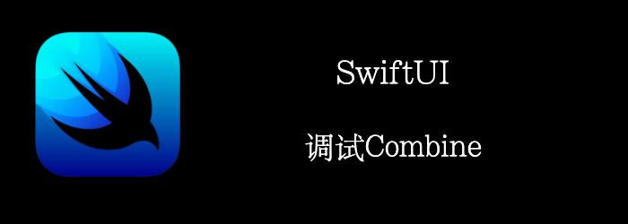

本章，我们将学习调试Combine Stream的三种方法。我承认这三个都有点基础。但是，它们是一个起点，应该足以帮助我们了解如何处理stream中的错误。
<!--truncate-->
## Getting ready

首先创建一个项目**DebuggingCombine**

## How to do it…

我们将直接创建3个按钮，来尝试调试Combine的3种方式。

1. 先创建一个包含3个事件的model
```swift
class ReactiveObject {
    private var cancellableSet: Set<AnyCancellable> = []
    func handleEvents() {

    }

    func printDebug() {

    }

    func breakPoint() {

    }
}
```

2. ContentView中加入3个按钮，调用这3个函数
```swift
struct ContentView: View {
    var reactiveObject = ReactiveObject()
    var body: some View {
        VStack(spacing: 24) {
            Button {
                reactiveObject.handleEvents()
            } label: {
                Text("HandleEvents")
                    .foregroundColor(.white)
                    .frame(width: 200, height: 50)
                    .background(Color.green)
            }

            Button {
                reactiveObject.printDebug()
            } label: {
                Text("Print")
                    .foregroundColor(.white)
                    .frame(width: 200, height: 50)
                    .background(Color.orange)
            }

            Button {
                reactiveObject.breakPoint()
            } label: {
                Text("Breakpoint")
                    .foregroundColor(.white)
                    .frame(width: 200, height: 50)
                    .background(Color.red)
            }
        }
    }
}
```

3. 实现我们的3个函数
```swift
func handleEvents() {
    let subject = PassthroughSubject<String, Never>()
    subject
    .handleEvents(receiveSubscription: {
        print("Receive subscription: \($0)")
    }, receiveOutput: {
        print("Received output: \($0)")
    }, receiveCompletion: {
        print("Receive completion: \($0)")
    }, receiveCancel: {
        print("Receive cancel")
    }, receiveRequest: {
        print("Receive request: \($0)")
    })
    .sink { _ in }
    .store(in: &cancellableSet)
    subject.send("New Message!")
}

func printDebug() {
    let subject = PassthroughSubject<String, Never>()
    subject
    .print("Print")
    .sink { _ in }
    .store(in: &cancellableSet)
    subject.send("New Message!")
}

func breakPoint() {
    (1..<10).publisher
    .breakpoint(receiveOutput: {
        $0 == 7
    }) { $0 == .finished }
    .sink { _ in }
    .store(in: &cancellableSet)
}
```


## How it works…

**.handleEvents()**提供了在接收各种值时的自定义操作。

**.print()** 是.handleEvents()的一个简单打印的版本。

**.breakpoint()**会在满足条件时进入断点。

另外推荐下http://timelane.tools/这个工具，让你能够可视化数据流。
