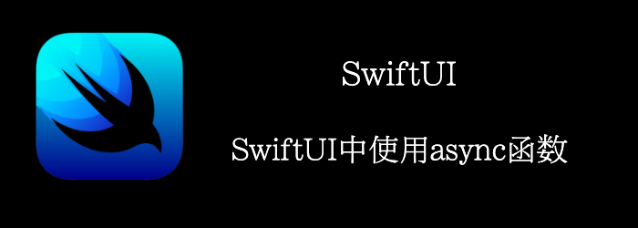

我们来看看一个sleep5秒的async函数。
<!--truncate-->
## Getting ready

创建一个新的项目：**AsyncAwaitSwiftUI**

## How to do it…

1. 定义一个Service
```swift
class Service {
    func fetchResult() async -> String {
        await sleep(seconds: 5)
        return "Result"
    }
    
    private func sleep(seconds: Int) async {
        try? await Task.sleep(nanoseconds: UInt64(seconds * 1000000000))
    }
}
```

2. 在ContentView中加个按钮
```swift
struct ContentView: View {
    let service = Service()
    @State var value: String = ""
    @State var counter = 0

    var body: some View {
        VStack {
            Text(value)
            Text("\(counter)")
            Button {
                counter += 1
            } label: {
                Text("increment")
            }
            .buttonStyle(.bordered)
        }.task {    
            value = await service.fetchResult()
        }
    }
}
```


## How it works…

.task修饰符和.onAppear修饰符类似，但不同之处在于/我们可以在.task修饰符中使用async函数，.onAppear却不行。

另外还有个需要注意的，async执行应该是在某个后台线程中执行的，但是我们UI的更新需要在主线程，如果我们打断点在.task中，发现确实是主线程，打断点在async函数中，也发现确实是在后台线程，所以我们可以看到.task会自动切换到主线程上执行。


