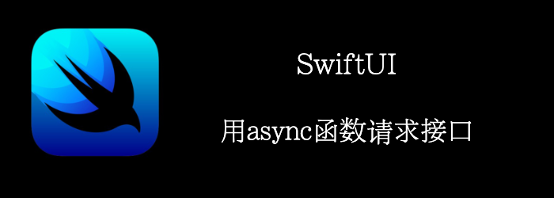

**async** **await**让网络请求变得简单了，我们不用再使用回调机制了。
<!--truncate-->
## Getting ready

首先，新建一个App：**SpamWords**。target保证ios15以上。

## How to do it…

1. 首先，创建我们的model
```swift
struct Language: Decodable, Identifiable {
    var id: String { code }
    let code: String
    let label: String
}

struct LanguageList: Decodable {
    let codeLanguages: [Language]
}

struct SpamWords: Decodable {
    let words: [String]
}
```

2. 创建一个service来发起请求
```swift
struct SpamWordsLanguagesService {
    private let decoder: JSONDecoder = {
        let decoder = JSONDecoder()
        decoder.keyDecodingStrategy = .convertFromSnakeCase
        return decoder
    }()
    
    private func fetch<T: Decodable>(type: T.Type, from urlString: String) async -> T? {
        guard let url = URL(string: urlString) else { return nil }
        do {
            let (data, _) = try await URLSession.shared.data(from: url, delegate: nil)
            return try decoder.decode(type, from: data)
        } catch {
            return nil
        }
    }
    
    func fetchLanguages() async -> [Language] {
        await fetch(type: LanguageList.self, from: "https://www.spam-words.com/api/languages")?.codeLanguages ?? []
    }
    
    func fetchWords(language: Language) async -> [String] {
        await fetch(type: SpamWords.self, from: "https://www.spam-words.com/api/words/" + language.code)?.words ?? []
    }
}
```

3. 创建我们的language列表
```swift
struct ContentView: View {
    let service = SpamWordsLanguagesService()
    @State var languages: [Language] = []
    var body: some View {
        NavigationView {
            List(languages) { language in
                NavigationLink {
                    Text(language.label)
                } label: {
                    Text(language.label)
                }
            }
            .listStyle(.plain)
            .navigationTitle("Languages")
            .task {
                languages = await service.fetchLanguages()
            }
        }
    }
}
```

4. 创建我们的words列表，并更换NavigationLink的destination为我们的word列表
```swift
struct SpamWordsView: View {
    let language: Language
    let service = SpamWordsLanguagesService()
    @State var words: [String] = []
    var body: some View {
        List(words, id: \.self) { word in
            Text(word)
        }
        .navigationTitle(language.label)
        .task {
          words = await service.fetchWords(language: language)
        }
    }
}
```


## How it works…

ios15开始，URLSession提供了async/await的相关接口。其返回一个data和httpResponse。

```swift
let (data, _) = try await URLSession.shared.data(from: url, delegate: nil)
```

