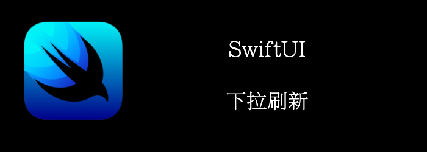

下拉刷新的功能很常见，在swiftui中也有支持，并且支持async/await。
<!--truncate-->
## Getting ready

首先新建一个项目：**RefreshableCrypto**，target选择ios15以上。

## How to do it…

1. 首先，创建Model

```swift
struct Coin: Decodable, Identifiable {
    let id: Int
    let coinName: String
    let acronym: String
    let logo: String
}
```

2. 创建我们的service
```swift
struct Service {
    private let decoder: JSONDecoder = {
        let decoder = JSONDecoder()
        decoder.keyDecodingStrategy = .convertFromSnakeCase
        return decoder
    }()

    func fetchCoins() async -> [Coin] {
        guard let url = URL(string:"https://random-data-api.com/api/crypto_coin/random_crypto_coin?size=10") else {
            return []
        }
        do {
            let (data, _) = try await URLSession.shared.data(from: url)
            let list = try decoder.decode([Coin].self, from: data)
            return list.sorted {
                $0.acronym < $1.acronym
            }
        } catch {
            return []
        }
    }
}
```

3. 创建列表, 获取数据
```swift
struct LogoView: View {
    let coin: Coin
    var body: some View {
        AsyncImage(url: URL(string: coin.logo), content: { image in
            image.resizable()
                .aspectRatio(contentMode: .fit)
                .frame(maxWidth: 40, maxHeight: 40)
            }, placeholder: {
                ProgressView()
            }
        )
    }
}

struct CoinView: View {
    let coin: Coin
    var body: some View {
        HStack {
            Text("\(coin.acronym): \(coin.coinName)")
            Spacer()
            LogoView(coin: coin)
        }
    }
}

@available(iOS 15.0, *)
struct ContentView: View {
    let service = Service()
    @State var coins: [Coin] = []
    var body: some View {
        List(coins) {
            CoinView(coin: $0)
        }
        .listStyle(.plain)
        .refreshable {
            coins = await service.fetchCoins()
        }.task {
            coins = await service.fetchCoins()
        }
    }
}
```


## How it works…

我们使用 **.refreshable{}**修饰符，添加下拉刷新功能。
