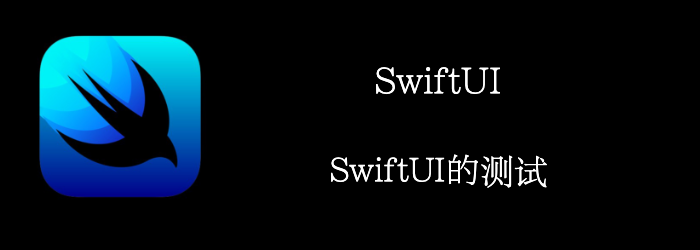

我们来看看SwiftUI的测试。
<!--truncate-->

## snapshot test


snapshot test 包含2个步骤：

- 在某个state下，截下屏幕图片
- 截下的图片和通用state正常图片对比是否一致

### Getting ready

首先，新建一个项目：**SnapshotTestingSwiftUI**

导入SnapshotTesting， `pod 'SnapshotTesting', '~> 1.9.0'`

### How to do it…

我们将用三张卡实现一个简单的视图，模拟三张不同的信用卡。

然后，我们将运行snapshot test得到一张标准的图片，这是一个我们预计正确的图像，以防止我们意外更改该视图。

最后，我们将更改卡片的顺序，看看运行测试时会发生什么。以下是步骤：

1. 首先准备数据和view
```swift
struct ContentView: View {
    let cards: [(title: String, color: Color)] = [
        ("Visa Card", .yellow),
        ("Mastercard Credit Card", .red),
        ("Apple Credit Card", .black),
    ]
    var body: some View {
        VStack(spacing: 16) {
            ForEach(0..<cards.count) { index in
                Text(cards[index].title)
                    .font(.system(.title))
                    .frame(maxWidth: .infinity, maxHeight: .infinity)
                    .foregroundColor(.white)
                    .background(cards[index].color)
                    .cornerRadius(16)
            }
        }.padding(.horizontal, 16)
    }
}
```

此时，我们的app长这样


2. 写好测试，运行一次，此时因为没有标准图片，会失败，此时会生成一张图片当做标准图片，我们再次运行，有了标准图片作比较，测试通过
```swift
extension Snapshotting where Value:View, Format == UIImage {
    public static func image(on config: ViewImageConfig) -> Snapshotting {
        Snapshotting<UIViewController,UIImage>.image(on:config)
            .pullback(UIHostingController.init(rootView:))
    }
}

class TheStacksTests: XCTestCase {

    override class func setUp() {
            diffTool = "ksdiff"
    }

    func testContentView() throws {
        assertSnapshot(matching: ContentView(), as: .image(on: .iPhoneXsMax))
    }
}
```

3. 我们修改一下state的顺序, 再运行下测试, 将失败，并在控制台打印出两个图片位置
```swift
 let cards: [(title: String, color: Color)] = [
    ("Mastercard Credit Card", .red),
   ("Visa Card", .yellow),
    ("Apple Credit Card", .black),
]
```

4. 你还可以通过**Kaleidoscope** ，运行命令直接查看两张图片的对比.

### How it works…

Swift Snapshot Testing 有一种机制叫做  **pullback**, 代表我们想要测试的component上要执行的test operation 。比如一个 SwiftUI **View**, 被转换成library已经支持的test operation( **UIViewController** 和 **UIImage**)

我们的demo中,  component 已经支持的是 **UIViewController**, 所以 **pullback** 会桥接我们的 **View** t到**UIViewController**, 把他嵌入一个 **UIHostingController**.

我们来看看整个流程：

首先，你得决定您将使用哪种设备进行测试。这是因为截图密度取决于设备屏幕的密度，例如，使用 iPhone 13 Pro Max 截取的截图无法与使用 SE 2 截取的截图进行比较。

然后，您还必须运行一次测试以创建参考图片。

之后，您必须检查快照是否符合您的预期。

你还可以通过工具比较图像，发现差异，比如： Kaleidoscope 。

最后是**diffTool**全局变量，如果你设置了，那么测试失败的消息中会以这个字符串开头。

如果设置了**diffTool**全局变量，内容会在测试失败的消息中呈现出来


## 使用ViewInspector进行测试

**XCTest**和**XCUITest**是成熟的框架，所以你希望 SwiftUI 有类似的东西。

不幸的是，SwiftUI 没有来自 Apple 的任何测试功能。要测试 SwiftUI 视图，您可以依赖本质上不稳定的**UI**测试，或者使用上一章讲的快照测试。

然而，开源的美妙之处在于，给定一个问题，社区会以某种方式找到解决方案。SwiftUI 单元测试和**ViewInspector**就是这种情况，这是一个用于检查和测试 SwiftUI 视图的框架。

### Getting ready

首先，新建一个项目：**TestingSwiftUI**

引入**ViewInspector**， `pod 'ViewInspector'`

### How to do it…

我们实现一个选择国家的功能，有多个按钮，每个代表一个国家，选择对应国家后，底部的文案会变成对应的国家。

1. 我们首先实现功能
```swift
struct ContentView: View {
    private let countries = [
        "USA",
        "France",
        "Germany",
        "Italy"
    ]

    @State var originCountry: Int = 0
    
    var body: some View {
        VStack(spacing: 12) {
            Text("What is your country of origin?")
            HStack(spacing: 12) {
                ForEach(0..<countries.count) { idx in
                    Button {
                        originCountry = idx
                    } label: {
                        Text(countries[idx])
                            .frame(width: 80, height: 40)
                            .background((originCountry == idx ? Color.red : Color.blue).opacity(0.6))
                            .cornerRadius(5)
                            .foregroundColor(.white)
                    }
                }
            }
            Spacer()
            Text(countries[originCountry])
                .font(.system(size: 40))
            Spacer()
        }
    }
}
```


2. 我们开始写测试, 首先应该默认显示USA
```swift
//导入ViewInspector
import ViewInspector
extension ContentView: Inspectable { }//遵循Inspectable协议

class TheStacksTests: XCTestCase {
    func testStartWithUSASelected() throws {
         let view = ContentView()
         let buttons = try view.inspect().vStack().hStack(1).forEach(0)
         XCTAssertEqual(try buttons.button(0).labelView().text().string(), "USA")
         XCTAssertEqual(try buttons.button(1).labelView().text().string(), "France")
         XCTAssertEqual(try buttons.button(2).labelView().text().string(), "Germany")
         XCTAssertEqual(try buttons.button(3).labelView().text().string(), "Italy")

         let country = try view.inspect().vStack().text(3)
         XCTAssertEqual(try country.string(), "USA")
     }

}
```

3. 当我们点击按钮时，应该显示对应的国家。这个功能依赖@State变量，不幸的是，ViewInspector当前还不支持@State变量，我们必须手动修改下ContentView的代码来克服这个限制。
```swift   
struct ContentView: View {
    //...
    var didAppear: ((Self) -> Void)?
    var body: some View {
       VStack(spacing: 12) {
        //...
        }
        .onAppear { didAppear?(self) }
    }
}
```

4. 现在我们可以编写我们的测试了
```swift
func testSelectItaly() throws {
    var view = ContentView()
    let exp = view.on(\.didAppear) { view in
        XCTAssertEqual(try view.actualView().originCountry, 0)
        try view.actualView().inspect().vStack().hStack(1).forEach(0).button(3).tap()
        XCTAssertEqual(try view.actualView().originCountry, 3)
    }
    ViewHosting.host(view: view)
    wait(for: [exp], timeout: 0.1)
}
```

### How it works…

最重要的是extension, 我们的View需要遵循**Inspectable**协议。

我们调用**inspect()**后会得到一个View层级结构，我们可以按照源码中的index去获取对应的组件。

```swift
try view.inspect().vStack().text(0)
try view.inspect().vStack().hStack(1)
try view.inspect().vStack().spacer(2)
try view.inspect().vStack().text(3)
```

如果存在交互，那就没这么简单了，我们必须增加一个闭包来捕获actual view ，之后我们才能在测试的闭包中使用actual view 。

```swift
let exp = view.on(\.didAppear) { view in
    XCTAssertEqual(try view.actualView().originCountry, 0)
    try view.actualView().inspect().vStack().hStack(1).forEach(0).button(3).tap()
  XCTAssertEqual(try view.actualView().originCountry, 3)
}
```