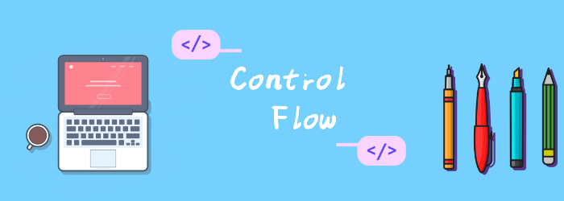

我们再来看看dart的控制流。

<!--truncate-->

## 控制流

###  If  else

注意条件必须是bool

```dart
if (isRaining()) {
  you.bringRainCoat();
} else if (isSnowing()) {
  you.wearJacket();
} else {
  car.putTopDown();
}
```

### for循环

```dart
var message = StringBuffer('Dart is fun');
for (var i = 0; i < 5; i++) {
  message.write('!');
}
//for in
for (final candidate in candidates) {
  candidate.interview();
}
//forEach
var collection = [1, 2, 3];
collection.forEach(print); // 1 2 3
```

### while和do white

```dart
while (!isDone()) {
  doSomething();
}

do {
  printLine();
} while (!atEndOfPage());
```

### Break 和 continue

```dart
while (true) {
  if (shutDownRequested()) break;
  processIncomingRequests();
}

for (int i = 0; i < candidates.length; i++) {
  var candidate = candidates[i];
  if (candidate.yearsExperience < 5) {
    continue;
  }
  candidate.interview();
}

//应该和其他语言一样支持标签，但是没看到官方文档说明, 但运行是没问题的
aa:
for (final i in [1, 2, 3, 4]) {
  for (final j in [6, 7, 8, 9]) {
    if (i * j == 18) {
      break aa;
    }
    print("$i  $j");
  }
}
```

### Switch  case

和其他语言的switch基本类型。注意每个case都需要break。

```dart
var command = 'OPEN';
switch (command) {
  case 'CLOSED':
    executeClosed();
    break;
  case 'PENDING':
    executePending();
    break;
  case 'APPROVED':
    executeApproved();
    break;
  case 'DENIED':
    executeDenied();
    break;
  case 'OPEN':
    executeOpen();
    break;
  default:
    executeUnknown();
}
```

###  Assert

product模式下，assert会被忽略

```dart
// Make sure the variable has a non-null value.
assert(text != null);
// Make sure the value is less than 100.
assert(number < 100);
// Make sure this is an https URL.
assert(urlString.startsWith('https'));
```
